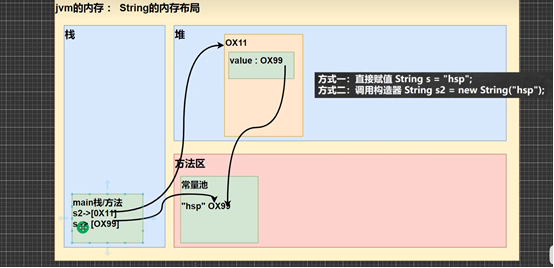

# 一.类和对象
>类就是数据类型,对象是具体的变量
>对象名存在栈（地址），对象存在堆和方法区（引用类型）


1. 全局变量与局部变量
全局变量有默认值，局部变量没有，需要赋值
外部类属性变量和局部变量可以重名，访问时遵循就近原则
局部变量前不能加修饰符
2. 对象创建流程
1.在方法区加载类，只会加载一次
2.在堆中分配空间，创建类的属性，其中引用类型的变量会在方法区的常量池中创建
3.完成对象初始化，先默认初始化，再根据类中的内容给age赋初值
4.根据构造器修改属性初值（默认初始化-显式初始化-构造器初始化）
5.在栈中创建对象名，将堆中的地址返回给p，对在堆中的对象能够进行对象引用


# 二.封装
目的：类里面的属性实现私有化，只能通过公共的setter方法进行访问修改,setter可以制定规则，但是构造器也是public，可以绕过setter制定的规则直接改，所以构造器的方法里面赋值直接用setter方法

## this
this可以访问该类的属性（this.name）全局变量
对象方法里面的this，指向该对象实例。否则只是函数内的局部变量，无论传什么该类的属性都是默认值
```java
//this可以在一个构造器中访问另一个构造器，语法this（参数），而且必须放在第一条语句
public T(int name){
  this.name = name;
}
public T(int name,int age){
//构造器复用
this(name);
this.age = age;
}
```
## 参数绑定
```java
// 1.基本类型参数绑定:形参给了方法内部的参数，各自指向各自的值，双方各自的后续修改，互不影响
public class Main {
    public static void main(String[] args) {
        Person p = new Person();
        int n = 15; // n的值为15
        p.setAge(n); // 传入n的值
        System.out.println(p.getAge()); // 15
        n = 20; // n的值改为20
        System.out.println(p.getAge()); // 15还是20?  15
    }
}

class Person {
    private int age;

    public int getAge() {
        return this.age;
    }

    public void setAge(int age) {
        this.age = age;
    }
}

// 2.引用类型参数绑定：传递的时候传的是数组的地址，对地址指向的对象内容修改，方法内部的参数内容跟着修改
public class Main {
    public static void main(String[] args) {
        Person p = new Person();
        String[] fullname = new String[] { "Homer", "Simpson" };
        p.setName(fullname); // 传入fullname数组
        System.out.println(p.getName()); // "Homer Simpson"
        fullname[0] = "Bart"; // fullname数组的第一个元素修改为"Bart"
        System.out.println(p.getName()); // "Homer Simpson"还是"Bart Simpson"?   Bart Simpson
    }
}

class Person {
    private String[] name;

    public String getName() {
        return this.name[0] + " " + this.name[1];
    }

    public void setName(String[] name) {
        this.name = name;
    }
}

```

# 三.构造方法
```java
//完成新对象初始化（不是创建），方法名和类名相同，没有返回值，由系统自动完成
class Person{
String name;
int age;
//构造器
public Person (String pname,int page)
{name=pname;
age=page;}
}
//调用 Person p1=new Person(“ss”,41);

//构造器重载
public Person (String pname){}

//不自己写构造器默认有构造器，自己声明了构造器不会有默认构造器
public Person(){}

```

# 四.继承和多态
## 访问修饰符
1. 将几个类整合到包，不同包中的类可以重名
2. 创建同名类前要加包名，只有一个可以import然后可以不写包名
3. 只有默认和public可以修饰类
4. protected能访问不同包的子类
5. 


## 继承
目的：解决代码复用
语法：
```java
class A extends B{
A独有属性
}
A继承了B的属性
```
1.子类不能访问父类的private属性，要通过父类的公共方法（public 数据类型 getxx（））访问
2.只要调用某一子类构造器，就会先调用父类的无参构造器初始化父类（默认会有super()）再调用子类；
如果父类没有无参构造器，则必须在子类的构造器中super(参数)对应父类的有参构造器
3.super必须放在子类构造器第一行，和this只能存在一个
4.所有的类的父类是Object，父类构造器的调用会一直追溯到Object的调用
5.java只能继承一个爸爸，要继承干爸，可以让干爸变成爷爷
### 继承的内存布局


1.new一个son，从object往下到son加载
2.堆中从爷爷（绿）到son（红）写信息，爷爷和son信息分别是独立空间，name不冲突，最后将整个大空间地址给栈中对象名son
3.调用name会从堆的son空间从下往上找，调用遇到的第一个。如果爷爷也有一个age，但爸爸（紫）有个private age ，调用son.age会报错，不会调用到爷爷的age

### super
super可以访问父类的属性和方法  super.属性   
super不局限于父类，父类没有会继续找父类的父类，私有的父类不能访问（报错）
super只能在方法或构造函数内部调用父类的成员
子类没有此方法，要调用父类方法
(1) 方法（）
(2) this.方法()
(3) super.方法      直接查找父类，可适用于子类有重名方法，要访问父类的方法

### 三.重载
传入不同的参数调用不同的解决方案，但方案名字和结果是一样的
1. 方法名必须相同
2. 形参列表必须不同
3. 返回类型无要求
```java
//可变参数
public int sum(int...nums){}
//1.nums可看作数组
//2.可传数组
```
### 重写
子类对父类方法的重写
1. 方法名必须相同
2. 形参列表必须相同
3. 返回类型是父类或父类返回类型的子类
4. 子类方法不能缩小父类方法的访问权限
5. 方法内容重写如果有要用到相同的super.方法

## 多态
通过变化的运行类型动态决定调用哪种子类方法
语法：
Anmal anmal = new Dog();
等号左边的Anmal指明了anmal这个对象引用名的编译类型是Anmal，右边表面现在anmal的运行类型是Dog
1. 等号左边的是编译类型，右边的是运行类型
2. 一个对象的编译类型和运行类型可以不一样
3. 运行类型可以变化,编译类型是不变的
   anmal = new Cat()
左边anmal的编译类型还是Anmal，运行类型变成Cat   
4. instanceOf用于判断对象的``运行类型``是否为XX类型或者XX类型的子类型
### 向上转型
Anmal anmal = new Cat();
1. 主函数anmal不能调用子类cat特有的方法（在编译阶段，能调用哪些成员是由编译类型决定的）
2. 调用方法运行时从运行类型开始找方法（调用前提1，即anmal得有这个方法名），先看cat里有没有对应重写的方法（重写作用）
3. 属性看的编译类型，不会先去找子类属性
### 向下转型
Cat cat = (cat) anmal
1. 语法：子类类型  引用名 = （子类类型）父类引用
2. 只能强转父类的引用，不能强转父类的对象
父类的引用:指向不同对象的变量名    父类的对象:对象实际数据new Anmal()
3. 要求父类的引用必须指向当前目标类型的的对象，即anmal先前必须指向cat,即Anmal anmal = new Cat()
4. 向下转型后，可以调用子类类型中所有成员
```java
public class DowncastingExample {
    public static void main(String[] args) {
        // 1. 父类引用指向子类对象
        Animal animal = new Cat();
        animal.name = "小白";
        
        // 2. 向下转型 - 正确的方式
        Cat cat = (Cat) animal;
        
        // 3. 现在可以调用子类特有的方法
        cat.color = "白色";
        cat.meow();           // 输出：猫在喵喵叫
        cat.catchMouse();     // 输出：猫在抓老鼠
        cat.eat();           // 也可以调用继承的方法
    }
}
```
## 动态绑定机制
当调用对象方法时，从运行时父类中要调用的方法应从运行类型子类开始找，属性没有动态绑定，属性在哪就用该处的值
```java
class A {
    public int i = 10;                    // 成员变量
    public int sum() { return getI() + 10; }  // 通过方法调用getI()
    public int sum1() { return i + 10; }      // 直接访问成员变量i
    public int getI() { return i; }           // 返回成员变量i
}
class B extends A {
    public int i = 20;                    // 覆盖父类的成员变量
    public int sum() { return i + 20; }       // 覆盖父类的sum()方法
    public int getI() { return i; }           // 覆盖父类的getI()方法
    public int sum1() { return i + 10; }      // 覆盖父类的sum1()方法
}
A a = new B();  // 向上转型：父类引用指向子类对象
System.out.println(a.sum());   // 输出：40
System.out.println(a.sum1());  // 输出：30
```
* 如果注销子类sum（）
主类运行a.sum（），方法从运行类型B开始找，没有，找到父类A的sum（）,其中getI()方法重新先从B开始找，返回20，结果30
* 如果注销子类sum1（）
同样找到父类sum1（）中的i，属性i没有动态绑定，就用本类的10，结果20

### 多态数组
数组是父类，里面放了子类

## ==与equals
### ==
1. ==是一个比较运算符，既可以判断基本类型，又可以判断引用类型
2. 如果判断基本类型，判断的是值是否相等
3. 如果判断引用类型，判断的是地址是否相等，即判断是不是同一个对象

### equals
1. equal只能判断引用类型，即默认判断地址是否相同，但是源码里String和Integer的equals重写成判断值是否相等

# 五.内置方法和修饰符
### toString
一般重写，有模板，当输出对象时System.out.printIn(对象)等价于默认调用System.out.print(对象.toString())
### finalize
当对象 没有被引用时，垃圾回收机制会销毁该对象，销毁该对象之前会调用该方法
### 断点调试
F7跳入方法内
F8随行执行代码
shift F8跳出方法
### 类变量，静态变量
静态变量：所有对象（同一个类）公用一个变量    public static String 变量
遵守修饰符，如private（只能类内访问）
类中的静态变量是随类加载而创建的，不用new对象也能在主函数访问   类名.类变量
### 类方法，静态方法
静态方法只能访问静态属性，不能用this，super
不创建实例也能调用方法，静态方法
### 代码块
作用：对构造器中重复的内容可以用代码块写到外面
* 普通代码块
类创建时会被调用，所以用类中的静态不会被调用
在调用构造器时，会先调用代码块中的内容，再调用构造器
* 静态代码块：
1. 对类初始化，随着类加载而执行，只会加载一次  （普通代码块，每创建一个对象就执行）
2. 什么时候类加载？new子类，先父类加载；new一个类；使用类的静态
3. 静态代码块只能调用静态成员

在一个类新new一个类：
先静态代码块，属性方法（第一次加载）然后普通的代码块，属性方法，最后是构造器

创建一个子类：
1.先从父类到子类 类加载，父类到子类加载静态代码块和静态方法
2.进入对象创建，构造器内先是super，所以先加载父类的构造器，里面有先普通代码块和普通属性的加载（谁先定义谁先加载） 然后回到子类加载普通代码块和普通属性。
### final
1. 在方法前，不能被继承 ； 在属性，变量前，不能修改  ； 在方法前，不能重写
2. 在定义时直接赋值，不然之后在代码块或者构造器里赋值
3. 如果是静态的static final ，则要在定义时或者静态代码块赋值，不能在构造器里赋值
static final 不会导致类加载
4. 包装类都是final
### 抽象类
1. 抽象方法：父类有些方法没什么要写的（子类会重写，父类要有，因为可以多态转型），把这个方法加上abstract  ，这个类也要加上abstract，抽象方法没有方法体
2. 抽象类不能实例化
3. 抽象类不一定要有抽象方法
4. 不能和private,final,static连用，不然继承的子类没法重写
5. 继承抽象类的子类要么自己也是抽象类（不用重写抽象类中的所有抽象方法），或者自己必须重写抽象类中的所有抽象方法
## 接口
1. 接口不能实例化，里面的方法都是public
2. 抽象类实现（重写）接口时可以不实现接口的方法（不用管接口定义的方法）
3. 一个类可以实现多个接口
4. 接口中的属性都是public static final
5. 接口不能继承类，但能继承多个别的接口
6. 创建接口的修饰符只能punlic和默认
7. 类实现接口，同样也实现了接口的父类（接口多态传递）
   
## 内部类
在类的方法里面创建一个内部类
### 局部内部类
1. 通常在方法中定义一个类
2. 可以访问外部类的所有成员，包括私有
3. 不能有修饰符，能加final，加了final不能被继承
4. 相当于一个局部变量，作用域只在定义的方法内或者代码块（在代码块里定义内部类时）
5. 外部类在创建内部类的方法中要调用内部类的方法时，要new一个
6. 内部类与外部类属性重名，就近原则；重名情况下，就近原则访问的时内部类的属性，如果要在内部类中访问外部类属性，外部类类名.this.属性名，这个相当于new  外部类类名的引用对象名的地址
```java
public class OuterClass {
    private String outerField = "外部类字段";
    private int value = 100;
    
    public void methodWithLocalClass() {
        String localVar = "局部变量";
        final String finalVar = "final局部变量";
        
        // 局部内部类定义
        class LocalInnerClass {
            private String innerField = "局部内部类字段";
            private int value = 200; // 与外部类属性重名
            
            public void innerMethod() {
                System.out.println("局部内部类方法");
                System.out.println("访问外部类私有字段: " + outerField);
                System.out.println("访问局部变量: " + localVar);
                System.out.println("访问final局部变量: " + finalVar);
                
                // 重名属性访问
                System.out.println("内部类value: " + value); // 就近原则，访问内部类的
                System.out.println("外部类value: " + OuterClass.this.value); // 访问外部类的
            }
        }
        
        // 在方法中创建局部内部类实例
        LocalInnerClass local = new LocalInnerClass();
        local.innerMethod();
    }
    
    public static void main(String[] args) {
        OuterClass outer = new OuterClass();
        outer.methodWithLocalClass();
    }
}
```
### 匿名内部类
语法：new class名或interface名（参数列表）{}  在方法里new外部类的时候加上{}，{}里面直接实现类的方法
```java
// 接口定义
interface Animal {
    void makeSound();
    void eat();
}

// 抽象类定义
abstract class Vehicle {
    abstract void start();
    void stop() {
        System.out.println("车辆停止");
    }
}

public class AnonymousInnerClassDemo {
    private String field = "外部类字段";
    
    public void testAnonymousClass() {
        // 1. 实现接口的匿名内部类
        Animal dog = new Animal() {
            @Override
            public void makeSound() {
                System.out.println("汪汪汪");
            }
            
            @Override
            public void eat() {
                System.out.println("狗吃骨头");
            }
        };
    
        dog.makeSound();
        dog.eat();
        
        // 2. 继承抽象类的匿名内部类
        Vehicle car = new Vehicle() {
            @Override
            void start() {
                System.out.println("汽车启动");
            }
            
            // 可以重写父类方法
            @Override
            void stop() {
                System.out.println("汽车刹车停止");
            }
        };
        
        car.start();
        car.stop();
        
        // 3. 继承普通类的匿名内部类
        Thread thread = new Thread() {
            @Override
            public void run() {
                System.out.println("匿名线程运行中");
                System.out.println("访问外部类字段: " + field);
            }
        };
        
        thread.start();
    }
    
    public static void main(String[] args) {
        AnonymousInnerClassDemo demo = new AnonymousInnerClassDemo();
        demo.testAnonymousClass();
    }
}
```
### 成员内部类
定义在外部类的成员位置
可以使用访问修饰符
可以访问外部类的所有成员
外部类要访问内部类需要创建实例
```java
public class OuterClass {
    private String outerField = "外部类字段";
    private static String staticField = "外部类静态字段";
    
    // 成员内部类
    public class MemberInnerClass {
        private String innerField = "成员内部类字段";
        
        public void innerMethod() {
            System.out.println("成员内部类方法");
            System.out.println("访问外部类实例字段: " + outerField);
            System.out.println("访问外部类静态字段: " + staticField);
        }
        
        // 内部类可以有静态方法（Java 16+）
        public static void staticMethod() {
            System.out.println("成员内部类静态方法");
            System.out.println("只能访问外部类静态成员: " + staticField);
        }
    }
    
    // 私有成员内部类
    private class PrivateInnerClass {
        public void method() {
            System.out.println("私有成员内部类方法");
        }
    }
    
    public void outerMethod() {
        // 外部类访问内部类
        MemberInnerClass inner = new MemberInnerClass();
        inner.innerMethod();
        
        PrivateInnerClass privateInner = new PrivateInnerClass();
        privateInner.method();
    }
    public MemberInnerClass getMemberInnerClass(){
        return new MemberInnerClass();
    };
    public static void main(String[] args) {
        OuterClass outer = new OuterClass();
        outer.outerMethod();
        
        // 外部创建成员内部类实例
        //1.外部类名.内部类名  内部类对象名 = 外部类对象名.new 内部类名（）；
        OuterClass.MemberInnerClass inner = outer.new MemberInnerClass();
        inner.innerMethod();
        //2.在外部类写一个方法返回内部类对象
        OuterClass.MemberInnerClass inner = outer.getMemberInnerClass();
    }
}
```
### 静态内部类
用static修饰的内部类
不能访问外部类的非静态成员
可以访问外部类的静态成员
不依赖外部类实例
```java
public class OuterClass {
    private String instanceField = "外部类实例字段";
    private static String staticField = "外部类静态字段";
    
    // 静态内部类
    public static class StaticInnerClass {
        private String innerField = "静态内部类字段";
        private static String staticInnerField = "静态内部类静态字段";
        
        public void instanceMethod() {
            System.out.println("静态内部类实例方法");
            System.out.println("访问外部类静态字段: " + staticField);
            // System.out.println(instanceField); // 编译错误，不能访问非静态成员
        }
        
        public static void staticMethod() {
            System.out.println("静态内部类静态方法");
            System.out.println("访问外部类静态字段: " + staticField);
        }
    }
    
    public static void main(String[] args) {
        // 直接创建静态内部类实例，不需要外部类实例
        StaticInnerClass staticInner = new StaticInnerClass();
        staticInner.instanceMethod();
        
        // 调用静态内部类的静态方法
        StaticInnerClass.staticMethod();
    }
}
```

## 自定义枚举类
```java
enum Season2 {
    //如果使用了enum 来实现枚举类
    //1.使用关键字 enum 替代 class
    //2. public static final Season SPRING = new Season("春天","温暖")直接使用
    //SPRING("春天","温暖")解读 常量名(实参列表)
    //3.如果有多个常量(对象),使用,号间隔即可
    //4.如果使用enum 来实现枚举,要求将定义常量对象,写在前面
    SPRING("春天","温暖"),
    WINTER("冬天","寒冷"),
    AUTUMN("秋天","凉爽"),
    SUMMER("夏天","炎热");
}


/*
name（）返回对象（常量）名 AUTUMN
ordinal（）返回位次
values（）方法，返回数组
valueOf（）
compareTo 比较位次号，返回前编号-后编号
*/
public class CompleteEnumDemo {
    public static void main(String[] args) {
        System.out.println("=== Java枚举类常用方法演示 ===\n");
        
        // 1. name() 方法演示
        System.out.println("1. name() 方法:");
        Season currentSeason = Season.AUTUMN;
        System.out.println("当前季节的常量名: " + currentSeason.name());
        System.out.println("当前季节的中文名: " + currentSeason.getChineseName());
        
        // 2. ordinal() 方法演示
        System.out.println("\n2. ordinal() 方法:");
        System.out.println("AUTUMN的位次: " + currentSeason.ordinal());
        
        // 3. values() 方法演示
        System.out.println("\n3. values() 方法:");
        Season[] allSeasons = Season.values();
        System.out.println("所有季节数量: " + allSeasons.length);
        for (Season season : allSeasons) {
            System.out.println("  " + season.name() + " (位次: " + season.ordinal() + ")");
        }
        
        // 4. valueOf() 方法演示
        System.out.println("\n4. valueOf() 方法:");
        try {
            Season spring = Season.valueOf("SPRING");
            System.out.println("通过valueOf获取SPRING: " + spring.getChineseName());
        } catch (IllegalArgumentException e) {
            System.out.println("枚举常量不存在");
        }
        
        // 5. compareTo() 方法演示
        System.out.println("\n5. compareTo() 方法:");
        Season spring = Season.SPRING;
        Season winter = Season.WINTER;
        int comparison = spring.compareTo(winter);
        System.out.println("SPRING.compareTo(WINTER): " + comparison);
        System.out.println("结果说明: " + (comparison < 0 ? "SPRING在WINTER之前" : 
                                        comparison > 0 ? "SPRING在WINTER之后" : "相同"));
        
        // 6. 实际应用：根据位次判断季节顺序
        System.out.println("\n6. 实际应用 - 季节顺序判断:");
        Season[] seasons = {Season.WINTER, Season.SPRING, Season.SUMMER, Season.AUTUMN};
        for (int i = 0; i < seasons.length - 1; i++) {
            Season current = seasons[i];
            Season next = seasons[i + 1];
            int result = current.compareTo(next);
            System.out.println(current.name() + " vs " + next.name() + 
                             ": " + result + " (" + 
                             (result < 0 ? "前" : result > 0 ? "后" : "同") + ")");
        }
    }
}
=== Java枚举类常用方法演示 ===

1. name() 方法:
当前季节的常量名: AUTUMN
当前季节的中文名: 秋天

2. ordinal() 方法:
AUTUMN的位次: 2

3. values() 方法:
所有季节数量: 4
  SPRING (位次: 0)
  SUMMER (位次: 1)
  AUTUMN (位次: 2)
  WINTER (位次: 3)

4. valueOf() 方法:
通过valueOf获取SPRING: 春天

5. compareTo() 方法:
SPRING.compareTo(WINTER): -3
结果说明: SPRING在WINTER之前

6. 实际应用 - 季节顺序判断:
WINTER vs SPRING: 3 (后)
SPRING vs SUMMER: -1 (前)
SUMMER vs AUTUMN: -1 (前)
```

## 包装类
### Integer和int转换
```java
int n1 = 100;
Integer integer = new Integer(n1);
Integer integer1 = Integer.valueOf(n1);
//手动拆箱
//Integer -> int
int i = integer.intValue();
//jdk5后,就可以自动装箱和自动拆箱
int n2 = 200;
//自动装箱 int->Integer
Integer integer2 = n2; //底层使用的是 Integer.valueOf(n2)
//自动拆箱 Integer->int
int n3 = integer2; //底层仍然使用的是 intValue()方法

//nteger装箱拆箱和比较
public class WrapperExercise02 {
    public static void main(String[] args) {
        Integer i = new Integer(1);
        Integer j = new Integer(1);
        System.out.println(i == j); //False
        //所以,这里主要是看范围-128~127 就是直接返回
        Integer m = 1; //底层 Integer.valueOf(1); -> 阅读源码
        Integer n = 1; //底层 Integer.valueOf(1);
        System.out.println(m == n); //T
        //,否则,就new Integer(xx);
        Integer x = 128; //底层Integer.valueOf(1);
        Integer y = 128; //底层Integer.valueOf(1);
        System.out.println(x == y); //False
    }
}
```
### 包装类和String相互转换
```java
//包装类(Integer)->String
Integer i = 100;//自动装箱
//方式1
String str1 = i + "";
//方式2
String str2 = i.toString();
//方式3
String str3 = String.valueOf(i);
//String -> 包装类(Integer)
String str4 = "12345";
Integer i2 = Integer.parseInt(str4);//使用到自动装箱
Integer i3 = new Integer(str4);//构造器
```
### String
1. String 类有很多构造器,构造器的重载
常用的有 String s1 = new String(); 
String s2 = new String(String original);
String s3 = new String(char[] a);
String s4 = new String(char[] a, int startIndex, int count)
String s5 = new String(byte[] b)
2. String 类实现了接口 Serializable 【String 可以串行化:可以在网络传输】
   接口 Comparable 【String 对象可以比较大小】
3. String 是final类,不能被其他的类继承
4. String 有属性 private final char value[]; 用于存放字符串内容
5. 一定要注意:value 是一个final类型, 不可以修改(需要功力):即value不能指向

#### 创建String对象
* 方式一：直接赋值   String s = "hsp";
先从常量池查看是否有"hsp"数据空间
如果有，直接指向
如果没有，重新创建
然后指向s最终指向的是常量池的空间地址
* 2. 方式二：调用构造器   String s2 = new String("hsp");
先在堆中创建空间，里面维护了value属性
value属性指向常量池中"hsp"空间
如果常量池没有"hsp"，重新创建
如果有，直接通过value指向
s2最终指向的是堆中的空间地址


String c = "ab" + "cd"; 常量相加,看的是池  栈直接指向方法区
String c = a + b; 变量相加,是在堆中    c是会在堆中创建一个新的对象，然后其指向常量池里的字符串
#### String常用方法
```java
public class StringMethodsDemo {
    public static void main(String[] args) {
        System.out.println("=== String常用方法演示 ===\n");
        
        // 1. 字符串比较
        System.out.println("1. 字符串比较:");
        String str1 = "Hello";
        String str2 = "hello";
        System.out.println("equals: " + str1.equals(str2)); // false
        System.out.println("equalsIgnoreCase: " + str1.equalsIgnoreCase(str2)); // true
        
        // 2. 长度和索引
        System.out.println("\n2. 长度和索引:");
        String str = "Hello World";
        System.out.println("长度: " + str.length());
        System.out.println("第一次出现'o': " + str.indexOf('o'));
        System.out.println("最后一次出现'o': " + str.lastIndexOf('o'));
        System.out.println("索引0的字符: " + str.charAt(0));
        
        // 3. 字符串截取
        System.out.println("\n3. 字符串截取:");
        String name = "hello, 张三";
        System.out.println("从索引6开始: " + name.substring(6));
        System.out.println("索引2到5: " + name.substring(2, 5));
        
        // 4. 字符串处理
        System.out.println("\n4. 字符串处理:");
        String text = "  Hello World  ";
        System.out.println("去空格: '" + text.trim() + "'");
        System.out.println("转大写: " + text.toUpperCase());
        System.out.println("转小写: " + text.toLowerCase());
        
        // 5. 字符串拼接和替换
        System.out.println("\n5. 字符串拼接和替换:");
        String s1 = "宝玉";
        String result = s1.concat("林黛玉").concat("薛宝钗");
        System.out.println("拼接结果: " + result);
        
        String replaceText = "宝玉 and 薛宝钗 薛宝钗";
        String replaced = replaceText.replace("薛宝钗", "林黛玉");
        System.out.println("替换结果: " + replaced);
        
        // 6. 字符串分割
        System.out.println("\n6. 字符串分割:");
        String poem = "锄禾日当午,汗滴禾下土,谁知盘中餐,粒粒皆辛苦";
        String[] lines = poem.split(",");
        System.out.println("分割结果:");
        for (String line : lines) {
            System.out.println("  " + line);
        }
        
        // 7. 字符串转换
        System.out.println("\n7. 字符串转换:");
        String word = "happy";
        char[] chars = word.toCharArray();
        System.out.println("字符数组:");
        for (char ch : chars) {
            System.out.print(ch + " ");
        }
        System.out.println();
    }
}
```
#### StringBuffer与String
* String
保存字符串常量：里面的值不能更改
每次更新：实际上就是更改地址，效率较低
内部实现：private final char value[];
* StringBuffer
StringBuffer是final类，不能被继承
保存字符串变量：里面的值可以更改
每次更新：可以更新内容，不用每次更新地址，效率较高
内部实现：char[] value; 这个放在堆中
内存示意图：StringBuffer对象指向Value字段，Value字段指向堆中的字符数组

#### StringBuffer构造器使用
```java
//1.创建一个大小为16的 char[],用于存放字符内容
StringBuffer stringBuffer = new StringBuffer();

//2 通过构造器指定 char[] 大小
StringBuffer stringBuffer1 = new StringBuffer(100);

//3.通过给一个String 创建 StringBuffer, char[] 大小就是 str.length() + 16
StringBuffer stringBuffer2 = new StringBuffer("hello");
```

#### String与StringBuffer转换
```java
//String转StringBuffer
String str = "hello tom";
//方式1 使用构造器
StringBuffer stringBuffer = new StringBuffer(str);
//方式2 使用的是append方法
StringBuffer stringBuffer1 = new StringBuffer();
stringBuffer1 = stringBuffer1.append(str);

//StringBuffer转String
StringBuffer stringBuffer3 = new StringBuffer("教育");
//方式1 使用StringBuffer提供的 toString方法
String s = stringBuffer3.toString();
//方式2:使用构造器来搞定
String s1 = new String(stringBuffer3);

```
#### StringBuffer常用方法
```java
//1.增加
s.append(','); // "hello,"
s.append("张三丰"); //"hello,张三丰"
s.append("赵敏").append(100).append(true).append(10.5); //"hello,张三丰赵敏100true10.5"
//2.删除
//删除索引为>=start && <end 处的字符
//解读:删除 11~14的字符 [11,14)
s.delete(11, 14);
System.out.println(s);//"hello,张三丰赵敏true10.5"
//3.修改
//使用周芷若替换索引9-11的字符[9,11)
s.replace(9, 11, "周芷若");
System.out.println(s);//"hello,张三丰周芷若true10.5"
//4.查找
//查找指定的子串在字符串第一次出现的索引,如果找不到返回-1
int indexOf = s.indexOf("张三丰");
System.out.println(indexOf);//6
//5.插入
//在索引为9的位置插入"赵敏",原来索引为9的内容自动后移
s.insert(9,"赵敏");
System.out.println(s);//"hello,张三丰赵敏周芷若true10.5"
```
#### StringBuilder
继承关系：StringBuilder 继承 AbstractStringBuilder类
序列化：实现了 Serializable,说明StringBuilder对象是可以串行化(对象可以网络传输,可以保存到文件)
final类：StringBuilder 是final类,不能被继承
字符存储：StringBuilder 对象字符序列仍然是存放在其父类 AbstractStringBuilder的 char[] value;因此,字符序列是堆中
线程安全：StringBuilder 的方法,没有做互斥的处理,即没有synchronized 关键字,因此在单线程的情况下使用StringBuilder
#### StringBuilder与StringBuffer使用原则和结论
如果字符串存在大量的修改操作，一般使用 StringBuffer 或 StringBuilder
如果字符串存在大量的修改操作，并在单线程的情况下，使用 StringBuilder
如果字符串存在大量的修改操作，并在多线程的情况下，使用 StringBuffer
如果我们字符串很少修改，被多个对象引用，使用 String，比如配置信息等

## 注解
@Override重写，有@Override系统会检查有没有重写
@inferface表示是一个注解类
@Target修饰注解的注解，元注解
@Deprecated 过时但能用
@SuperessWarnings 抑制警告

## Math方法
```java
// 绝对值
int abs = Math.abs(-9); // 9
// 求幂
double pow = Math.pow(2, 4); // 16.0
// 开方
double sqrt = Math.sqrt(9.0); // 3.0
// 向上取整
double ceil = Math.ceil(3.9); // 4.0
// 向下取整
double floor = Math.floor(4.001); // 4.0
// 四舍五入
long round = Math.round(5.51); // 6
// 生成0-1之间的随机小数
double random = Math.random(); // 0 <= x < 1
// 生成a到b之间的随机整数
int randomInt = (int)(a + Math.random() * (b - a + 1));
```
## 数组方法
```java
// 默认排序（升序）
Arrays.sort(arr);

// 自定义排序
Arrays.sort(arr, new Comparator() {
    @Override
    public int compare(Object o1, Object o2) {
        Integer i1 = (Integer) o1;
        Integer i2 = (Integer) o2;
        return i1 - i2; // 升序
    }
});

// 二分查找（要求数组已排序）
int index = Arrays.binarySearch(arr, 567);
// 如果找不到，返回 -(插入点 + 1)

// 复制数组
Integer[] newArr = Arrays.copyOf(arr, newLength);
// 如果新长度 > 原长度，用null填充
// 如果新长度 < 0，抛出NegativeArraySizeException

// 用指定值填充数组
Arrays.fill(num, 99);

// 比较两个数组是否相等
boolean equals = Arrays.equals(arr, arr2);

// 将数组转换为List
List asList = Arrays.asList(2,3,4,5,6,1);
// 编译类型：List，运行类型：java.util.Arrays$ArrayList

// 打印数组内容
System.out.println(Arrays.toString(integers));

// 底层数组复制方法
System.arraycopy(src, 0, dest, 0, 3);
// 参数：源数组，源起始位置，目标数组，目标起始位置，复制长度
```
## System方法
```java
// 退出程序
System.exit(0); // 0表示正常退出

// 获取当前时间（毫秒）
long currentTime = System.currentTimeMillis();
// 返回从1970-1-1到现在的毫秒数
```
## 大数处理方案
### 大整数
```java
BigInteger bigInteger = new BigInteger("23788888899999999999999999999");
BigInteger bigInteger2 = new BigInteger("100");
System.out.println(bigInteger);

//1. 在对 BigInteger 进行加减乘除的时候,需要使用对应的方法,不能直接进行 + - * /
//2.可以创建一个要操作的 BigInteger 然后进行相应操作

BigInteger add = bigInteger.add(bigInteger2);
System.out.println(add);//加
BigInteger subtract = bigInteger.subtract(bigInteger2);
System.out.println(subtract); //减
BigInteger multiply = bigInteger.multiply(bigInteger2);
System.out.println(multiply);//乘
BigInteger divide = bigInteger.divide(bigInteger2);
System.out.println(divide);//除
```
### 长小数
```java
//当我们需要保存一个精度很高的数时,double 不够用
//可以是 BigDecimal
double d = 1999.11111111111999999999999977788d;
System.out.println(d);

BigDecimal bigDecimal = new BigDecimal("1999.11111111111999999999999977788");
BigDecimal bigDecimal2 = new BigDecimal("1.1");
System.out.println(bigDecimal);

//1. 如果对 BigDecimal进行运算,比如加减乘除,需要使用对应的方法
//2.创建一个需要操作的 BigDecimal 然后调用相应的方法即可
System.out.println(bigDecimal.add(bigDecimal2));//加

//在调用divide 方法时,指定精度即可. BigDecimal.ROUND_CEILING
//如果有无限循环小数,就会保留分子的精度
System.out.println(bigDecimal.divide(bigDecimal2, BigDecimal.ROUND_CEILING));//除
```
## 第三代日历
### 前两代日历的不足
1. Date类问题（JDK 1.0）
大部分方法已被弃用（deprecated）
年份从1900开始计算（偏移性）
月份从0开始计算（0=1月，1=2月）
不是线程安全的
2. Calendar类问题（JDK 1.1）
可变性：日期时间类应该是不可变的，但Calendar是可变的
偏移性：年份和月份计算不直观
格式化：格式化主要对Date有效，Calendar不方便
线程安全：不是线程安全的
闰秒处理：无法处理闰秒等复杂时间概念
### 第三代日历方法
```java
public class ThirdGenerationCalendarDemo {
    public static void main(String[] args) {
        // 1. 获取当前日期时间
        LocalDateTime now = LocalDateTime.now();
        System.out.println("当前时间: " + now);
        
        // 2. 获取具体信息
        System.out.println("年: " + now.getYear());
        System.out.println("月: " + now.getMonthValue());
        System.out.println("日: " + now.getDayOfMonth());
        System.out.println("时: " + now.getHour());
        System.out.println("分: " + now.getMinute());
        System.out.println("秒: " + now.getSecond());
        
        // 3. 格式化输出
        DateTimeFormatter formatter = DateTimeFormatter.ofPattern("yyyy年MM月dd日 HH时mm分ss秒");
        String formatted = formatter.format(now);
        System.out.println("格式化时间: " + formatted);
        
        // 4. 日期时间操作
        LocalDateTime tomorrow = now.plusDays(1);
        LocalDateTime lastWeek = now.minusWeeks(1);
        // 所有操作都返回新对象，原对象不变
        System.out.println("明天: " + tomorrow);
        System.out.println("上周: " + lastWeek);
    }
}
```

# 六.泛型
* 接收指定的某种数据类型 
* 集合里只能放规定的类型
## 泛型类和泛型方法
### 普通成员可以使用泛型（属性，方法）
```java
class MyClass<T> {
    private T data;           // 属性可以使用泛型
    public T getData() {      // 方法可以使用泛型
        return data;
    }
}
```
### 使用泛型的数组，不能初始化
```java
class MyClass<T> {
    T[] array;                    // 正确：声明泛型数组
    // T[] array = new T[10];     // 错误：不能初始化泛型数组  原因：没有确定类型，无法开辟多少空间
    
    // 正确的替代方案
    @SuppressWarnings("unchecked")
    T[] createArray(int size) {
        return (T[]) new Object[size];  // 使用Object数组然后强制转换
    }
}
```
### 静态方法不能使用类的泛型
```java
class MyClass<T> {
    private T data;
    
    // 错误：静态方法不能使用类的泛型
    // public static void print(T data) { }
    
    // 正确：静态方法可以定义自己的泛型
    public static <U> void print(U data) {
        System.out.println(data);
    }

    //hi不是泛型方法，而是方法使用了类的泛型
    public void hi (T data){}
}
```
### 泛型类型在创建对象时确定
### 未指定类型时默认为Object

## 泛型的继承和通配
### 泛型不具备继承性
```java
// 这是错误的！编译不通过
List<Object> list = new ArrayList<String>(); // 编译错误
// 如果允许上面的赋值，就会出现类型安全问题
List<Object> list = new ArrayList<String>(); // 假设允许
list.add(new Integer(123)); // 向List<Object>添加Integer
// 但实际上list引用的是ArrayList<String>，这会导致类型不安全
```
### <?>支持任意泛型类型
### <? extends A>支持A类以及A类的子类，规定了泛型的上限。
### <? super A>支持A类以及A类的父类，不限于直接父类，规定了泛型的下限。
