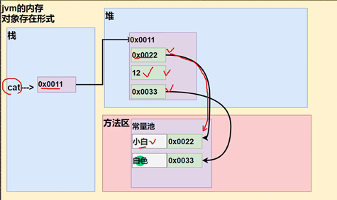
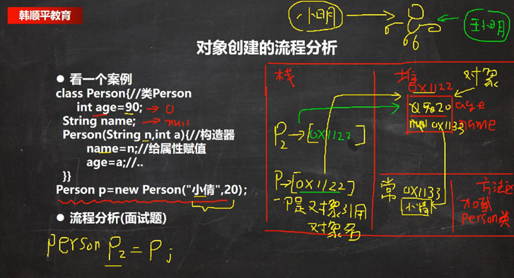
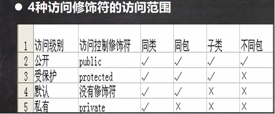
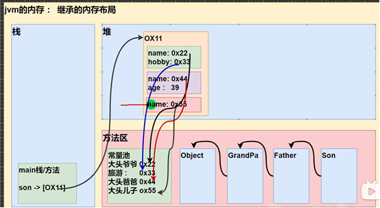

# 一.类和对象
>类就是数据类型,对象是具体的变量
>对象名存在栈（地址），对象存在堆和方法区（引用类型）



1. 全局变量与局部变量
全局变量有默认值，局部变量没有，需要赋值
外部类属性变量和局部变量可以重名，访问时遵循就近原则
局部变量前不能加修饰符
2. 对象创建流程
1.在方法区加载类，只会加载一次
2.在堆中分配空间，创建类的属性，其中引用类型的变量会在方法区的常量池中创建
3.完成对象初始化，先默认初始化，再根据类中的内容给age赋初值
4.根据构造器修改属性初值（默认初始化-显式初始化-构造器初始化）
5.在栈中创建对象名，将堆中的地址返回给p，对在堆中的对象能够进行对象引用



# 二.封装
目的：类里面的属性实现私有化，只能通过公共的setter方法进行访问修改,setter可以制定规则，但是构造器也是public，可以绕过setter制定的规则直接改，所以构造器的方法里面赋值直接用setter方法

## this
this可以访问该类的属性（this.name）全局变量
对象方法里面的this，指向该对象实例。否则只是函数内的局部变量，无论传什么该类的属性都是默认值
```java
//this可以在一个构造器中访问另一个构造器，语法this（参数），而且必须放在第一条语句
public T(int name){
  this.name = name;
}
public T(int name,int age){
//构造器复用
this(name);
this.age = age;
}
```
## 参数绑定
```java
// 1.基本类型参数绑定:形参给了方法内部的参数，各自指向各自的值，双方各自的后续修改，互不影响
public class Main {
    public static void main(String[] args) {
        Person p = new Person();
        int n = 15; // n的值为15
        p.setAge(n); // 传入n的值
        System.out.println(p.getAge()); // 15
        n = 20; // n的值改为20
        System.out.println(p.getAge()); // 15还是20?  15
    }
}

class Person {
    private int age;

    public int getAge() {
        return this.age;
    }

    public void setAge(int age) {
        this.age = age;
    }
}

// 2.引用类型参数绑定：传递的时候传的是数组的地址，对地址指向的对象内容修改，方法内部的参数内容跟着修改
public class Main {
    public static void main(String[] args) {
        Person p = new Person();
        String[] fullname = new String[] { "Homer", "Simpson" };
        p.setName(fullname); // 传入fullname数组
        System.out.println(p.getName()); // "Homer Simpson"
        fullname[0] = "Bart"; // fullname数组的第一个元素修改为"Bart"
        System.out.println(p.getName()); // "Homer Simpson"还是"Bart Simpson"?   Bart Simpson
    }
}

class Person {
    private String[] name;

    public String getName() {
        return this.name[0] + " " + this.name[1];
    }

    public void setName(String[] name) {
        this.name = name;
    }
}

```

# 三.构造方法
```java
//完成新对象初始化（不是创建），方法名和类名相同，没有返回值，由系统自动完成
class Person{
String name;
int age;
//构造器
public Person (String pname,int page)
{name=pname;
age=page;}
}
//调用 Person p1=new Person(“ss”,41);

//构造器重载
public Person (String pname){}

//不自己写构造器默认有构造器，自己声明了构造器不会有默认构造器
public Person(){}

```

# 四.继承和多态
## 访问修饰符
1. 将几个类整合到包，不同包中的类可以重名
2. 创建同名类前要加包名，只有一个可以import然后可以不写包名
3. 只有默认和public可以修饰类
4. protected能访问不同包的子类
5. 


## 继承
目的：解决代码复用
语法：
```java
class A extends B{
A独有属性
}
A继承了B的属性
```
1.子类不能访问父类的private属性，要通过父类的公共方法（public 数据类型 getxx（））访问
2.只要调用某一子类构造器，就会先调用父类的无参构造器初始化父类（默认会有super()）再调用子类；
如果父类没有无参构造器，则必须在子类的构造器中super(参数)对应父类的有参构造器
3.super必须放在子类构造器第一行，和this只能存在一个
4.所有的类的父类是Object，父类构造器的调用会一直追溯到Object的调用
5.java只能继承一个爸爸，要继承干爸，可以让干爸变成爷爷
### 继承的内存布局



1.new一个son，从object往下到son加载
2.堆中从爷爷（绿）到son（红）写信息，爷爷和son信息分别是独立空间，name不冲突，最后将整个大空间地址给栈中对象名son
3.调用name会从堆的son空间从下往上找，调用遇到的第一个。如果爷爷也有一个age，但爸爸（紫）有个private age ，调用son.age会报错，不会调用到爷爷的age

### super
super可以访问父类的属性和方法  super.属性   
super不局限于父类，父类没有会继续找父类的父类，私有的父类不能访问（报错）
super只能在方法或构造函数内部调用父类的成员
子类没有此方法，要调用父类方法
(1) 方法（）
(2) this.方法()
(3) super.方法      直接查找父类，可适用于子类有重名方法，要访问父类的方法

### 三.重载
传入不同的参数调用不同的解决方案，但方案名字和结果是一样的
1. 方法名必须相同
2. 形参列表必须不同
3. 返回类型无要求
```java
//可变参数
public int sum(int...nums){}
//1.nums可看作数组
//2.可传数组
```
### 重写
子类对父类方法的重写
1. 方法名必须相同
2. 形参列表必须相同
3. 返回类型是父类或父类返回类型的子类
4. 子类方法不能缩小父类方法的访问权限
5. 方法内容重写如果有要用到相同的super.方法

## 多态
通过变化的运行类型动态决定调用哪种子类方法
语法：
Anmal anmal = new Dog();
等号左边的Anmal指明了anmal这个对象引用名的编译类型是Anmal，右边表面现在anmal的运行类型是Dog
1. 等号左边的是编译类型，右边的是运行类型
2. 一个对象的编译类型和运行类型可以不一样
3. 运行类型可以变化,编译类型是不变的
   anmal = new Cat()
左边anmal的编译类型还是Anmal，运行类型变成Cat   
4. instanceOf用于判断对象的``运行类型``是否为XX类型或者XX类型的子类型
### 向上转型
Anmal anmal = new Cat();
1. 主函数anmal不能调用子类cat特有的方法（在编译阶段，能调用哪些成员是由编译类型决定的）
2. 调用方法运行时从运行类型开始找方法（调用前提1，即anmal得有这个方法名），先看cat里有没有对应重写的方法（重写作用）
3. 属性看的编译类型，不会先去找子类属性
### 向下转型
Cat cat = (cat) anmal
1. 语法：子类类型  引用名 = （子类类型）父类引用
2. 只能强转父类的引用，不能强转父类的对象
父类的引用:指向不同对象的变量名    父类的对象:对象实际数据new Anmal()
3. 要求父类的引用必须指向当前目标类型的的对象，即anmal先前必须指向cat,即Anmal anmal = new Cat()
4. 向下转型后，可以调用子类类型中所有成员
```java
public class DowncastingExample {
    public static void main(String[] args) {
        // 1. 父类引用指向子类对象
        Animal animal = new Cat();
        animal.name = "小白";
        
        // 2. 向下转型 - 正确的方式
        Cat cat = (Cat) animal;
        
        // 3. 现在可以调用子类特有的方法
        cat.color = "白色";
        cat.meow();           // 输出：猫在喵喵叫
        cat.catchMouse();     // 输出：猫在抓老鼠
        cat.eat();           // 也可以调用继承的方法
    }
}
```
## 动态绑定机制
当调用对象方法时，从运行时父类中要调用的方法应从运行类型子类开始找，属性没有动态绑定，属性在哪就用该处的值
```java
class A {
    public int i = 10;                    // 成员变量
    public int sum() { return getI() + 10; }  // 通过方法调用getI()
    public int sum1() { return i + 10; }      // 直接访问成员变量i
    public int getI() { return i; }           // 返回成员变量i
}
class B extends A {
    public int i = 20;                    // 覆盖父类的成员变量
    public int sum() { return i + 20; }       // 覆盖父类的sum()方法
    public int getI() { return i; }           // 覆盖父类的getI()方法
    public int sum1() { return i + 10; }      // 覆盖父类的sum1()方法
}
A a = new B();  // 向上转型：父类引用指向子类对象
System.out.println(a.sum());   // 输出：40
System.out.println(a.sum1());  // 输出：30
```
* 如果注销子类sum（）
主类运行a.sum（），方法从运行类型B开始找，没有，找到父类A的sum（）,其中getI()方法重新先从B开始找，返回20，结果30
* 如果注销子类sum1（）
同样找到父类sum1（）中的i，属性i没有动态绑定，就用本类的10，结果20

### 多态数组
数组是父类，里面放了子类

## ==与equals
### ==
1. ==是一个比较运算符，既可以判断基本类型，又可以判断引用类型
2. 如果判断基本类型，判断的是值是否相等
3. 如果判断引用类型，判断的是地址是否相等，即判断是不是同一个对象

### equals
1. equal只能判断引用类型，即默认判断地址是否相同，但是源码里String和Integer的equals重写成判断值是否相等

# 五.内置方法和修饰符
### toString
一般重写，有模板，当输出对象时System.out.printIn(对象)等价于默认调用System.out.print(对象.toString())
### finalize
当对象 没有被引用时，垃圾回收机制会销毁该对象，销毁该对象之前会调用该方法
### 断点调试
F7跳入方法内
F8随行执行代码
shift F8跳出方法
### 类变量，静态变量
静态变量：所有对象（同一个类）公用一个变量    public static String 变量
遵守修饰符，如private（只能类内访问）
类中的静态变量是随类加载而创建的，不用new对象也能在主函数访问   类名.类变量
### 类方法，静态方法
静态方法只能访问静态属性，不能用this，super
不创建实例也能调用方法，静态方法
### 代码块
作用：对构造器中重复的内容可以用代码块写到外面
* 普通代码块
类创建时会被调用，所以用类中的静态不会被调用
在调用构造器时，会先调用代码块中的内容，再调用构造器
* 静态代码块：
1. 对类初始化，随着类加载而执行，只会加载一次  （普通代码块，每创建一个对象就执行）
2. 什么时候类加载？new子类，先父类加载；new一个类；使用类的静态
3. 静态代码块只能调用静态成员

在一个类新new一个类：
先静态代码块，属性方法（第一次加载）然后普通的代码块，属性方法，最后是构造器

创建一个子类：
1.先从父类到子类 类加载，父类到子类加载静态代码块和静态方法
2.进入对象创建，构造器内先是super，所以先加载父类的构造器，里面有先普通代码块和普通属性的加载（谁先定义谁先加载） 然后回到子类加载普通代码块和普通属性。
### final
1. 在方法前，不能被继承 ； 在属性，变量前，不能修改  ； 在方法前，不能重写
2. 在定义时直接赋值，不然之后在代码块或者构造器里赋值
3. 如果是静态的static final ，则要在定义时或者静态代码块赋值，不能在构造器里赋值
static final 不会导致类加载
4. 包装类都是final
### 抽象类
1. 抽象方法：父类有些方法没什么要写的（子类会重写，父类要有，因为可以多态转型），把这个方法加上abstract  ，这个类也要加上abstract，抽象方法没有方法体
2. 抽象类不能实例化
3. 抽象类不一定要有抽象方法
4. 不能和private,final,static连用，不然继承的子类没法重写
5. 继承抽象类的子类要么自己也是抽象类（不用重写抽象类中的所有抽象方法），或者自己必须重写抽象类中的所有抽象方法
## 接口
1. 接口不能实例化，里面的方法都是public
2. 抽象类实现（重写）接口时可以不实现接口的方法（不用管接口定义的方法）
3. 一个类可以实现多个接口
4. 接口中的属性都是public static final
5. 接口不能继承类，但能继承多个别的接口
6. 创建接口的修饰符只能punlic和默认
7. 类实现接口，同样也实现了接口的父类（接口多态传递）
   
## 内部类
### 局部内部类
1. 通常在方法中定义一个类
2. 可以访问外部类的所有成员，包括私有
3. 不能有修饰符，能加final，加了final不能被继承
4. 相当于一个局部变量，作用域只在定义的方法内或者代码块（在代码块里定义内部类时）
5. 外部类在创建内部类的方法中要调用内部类的方法时，要new一个
6. 内部类与外部类属性重名，就近原则；重名情况下，就近原则访问的时内部类的属性，如果要在内部类中访问外部类属性，外部类类名.this.属性名，这个相当于new  外部类类名的引用对象名的地址

# ==============================TODO============================================

## 自定义枚举类

# 六.泛型
* 接收指定的某种数据类型 
* 集合里只能放规定的类型
## 泛型类和泛型方法
### 普通成员可以使用泛型（属性，方法）
```java
class MyClass<T> {
    private T data;           // 属性可以使用泛型
    public T getData() {      // 方法可以使用泛型
        return data;
    }
}
```
### 使用泛型的数组，不能初始化
```java
class MyClass<T> {
    T[] array;                    // 正确：声明泛型数组
    // T[] array = new T[10];     // 错误：不能初始化泛型数组  原因：没有确定类型，无法开辟多少空间
    
    // 正确的替代方案
    @SuppressWarnings("unchecked")
    T[] createArray(int size) {
        return (T[]) new Object[size];  // 使用Object数组然后强制转换
    }
}
```
### 静态方法不能使用类的泛型
```java
class MyClass<T> {
    private T data;
    
    // 错误：静态方法不能使用类的泛型
    // public static void print(T data) { }
    
    // 正确：静态方法可以定义自己的泛型
    public static <U> void print(U data) {
        System.out.println(data);
    }

    //hi不是泛型方法，而是方法使用了类的泛型
    public void hi (T data){}
}
```
### 泛型类型在创建对象时确定
### 未指定类型时默认为Object

## 泛型的继承和通配
### 泛型不具备继承性
```java
// 这是错误的！编译不通过
List<Object> list = new ArrayList<String>(); // 编译错误
// 如果允许上面的赋值，就会出现类型安全问题
List<Object> list = new ArrayList<String>(); // 假设允许
list.add(new Integer(123)); // 向List<Object>添加Integer
// 但实际上list引用的是ArrayList<String>，这会导致类型不安全
```
### <?>支持任意泛型类型
### <? extends A>支持A类以及A类的子类，规定了泛型的上限。
### <? super A>支持A类以及A类的父类，不限于直接父类，规定了泛型的下限。
