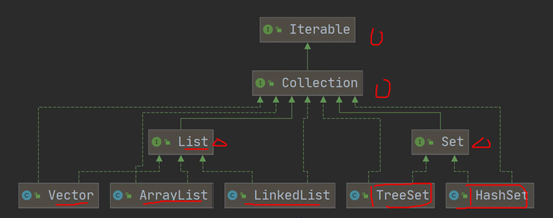
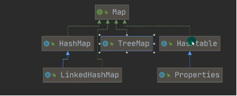

# 集合
## 单列集合



### Collection接口方法
.add(12)            添加单个元素
.remove(12)         删除指定元素
.contains(12)       查找指定元素是否存在
.addAll(list)       添加多个元素
.removeAll(list)    删除多个元素
.containsAll(list)  查找多个元素是否存在
.size()             获取元素个数
.isEmpty()          判断是否为空
.clear()            清空
#### 迭代器遍历   快捷键while => itit
所有实现了Collection接口的集合类都有一个iterator()方法，返回一个实现了Iterator接口的对象
```java
//想要遍历集合col
Arraylist col = new Arraylist();
//返回一个实现了Iterator接口的对象
Iterator iterator = col.iterator();
//hasNext()判断栈是否有下一个元素
while(iterator.hasNext()){
//iterator.next()指针下移，并且将下移以后的值返回
Object obj = iterator.next();
}
```
### List接口方法
* 特点：
1. List集合类中元素有序（添加顺序与取出顺序一致，队列？），且不可重复
2. List集合中每个元素都有其对应的顺序索引，从0开始
#  ============================== todo ===============================
## 双列集合

