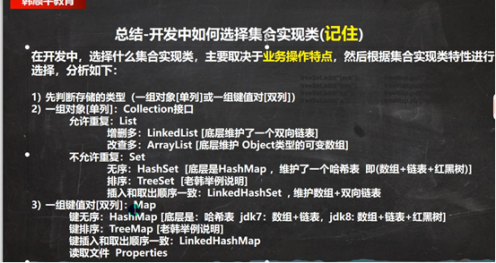

# 集合
## 单列集合


### Collection接口方法
.add(12)            添加单个元素
.remove(12)         删除指定元素
.contains(12)       查找指定元素是否存在
.addAll(list)       添加多个元素
.removeAll(list)    删除多个元素
.containsAll(list)  查找多个元素是否存在
.size()             获取元素个数
.isEmpty()          判断是否为空
.clear()            清空
#### 迭代器遍历   快捷键while => itit
所有实现了Collection接口的集合类都有一个iterator()方法，返回一个实现了Iterator接口的对象
```java
//想要遍历集合col
Arraylist col = new Arraylist();
//返回一个实现了Iterator接口的对象
Iterator iterator = col.iterator();
//hasNext()判断栈是否有下一个元素
while(iterator.hasNext()){
//iterator.next()指针下移，并且将下移以后的值返回
Object obj = iterator.next();
}
```
### List接口方法
* 特点：
1. List集合类中元素有序（添加顺序与取出顺序一致，队列？），且不可重复
2. List集合中每个元素都有其对应的顺序索引，从0开始

.add(1,"12")       指定索引添加单个元素
.add(1,lsit)       指定索引添加多个元素
.get(index)        获取指定索引的元素
.indexOf("12")     获取指定元素的索引
.lastIndexOf("12") 获取指定元素最后出现的位置
.remove(index)     移除指定索引的元素
.set(index,"12")   替换指定索引的元素
.subList(fromIndex,toIndex)   返回子集合 fromIndex<=subList<toIndex

### ArrayList
1. 可放null
2. 线程不安全
3. transient修饰，不会被序列化 
4. 改查效率较高
#### ArrayList扩容
1. ArrayList中维护了一个Object类型的数组elementData. [debug 看源码]
transient Object[] elementData;
1. 当创建ArrayList对象时, 如果使用的是无参构造器, 则初始elementData容量为0, 第1次添加, 则扩容elementData为10, 如需要再次扩容, 则扩容elementData为1.5倍。
2. 如果使用的是指定大小的构造器, 则初始elementData容量为指定大小, 如果需要扩容, 则直接扩容elementData为1.5倍。

### Vector
线程安全
#### Vector扩容
1. 无参，默认10，满后，按两倍扩
2. 指定大小，每次按两倍扩

### Linkedlist
1. 删除效率高(双向链表和双端队列)
2. 线程不安全
3. 可添加重复元素，包括null


### set接口
* 无序，不能重复，无索引
#### HashSet扩容（数组列表）
1. HashSet 底层是 HashMap
2. 当添加元素java时，先add(E e)方法中e是要添加的字符串java  返回null表示成功，再put(K Key ,V Value)方法k key是java   v value是静态共享的Object类型的PRESENT,最后根据hash（key）得到java的哈希值（不是哈希code）
3. putValue进行扩容table数组链表，第一次为空或数组长度为0执行resize方法扩容到16个，临界16*0.75=12个会再次触发扩容，12个指的是加入的对象。第二次扩容扩容原来的两倍，table 16->32,临界值 12->24
4. 然后根据Hash值定位p，看p的位置是否为null，是null就new存放
5. 如果该地址p不为null，则判断对象是否相同或调用equal方法比较的东西是否相同，如果相同,就放弃添加,如果不相同,则添加到最后
6. 不相同添加到最后，判断是否红黑树，是就调用putTreeVaule添加，不是则循环比较链表后面的，不相同挂载在链表最后，加入后要判断是否要树化treeifyBin，树化条件数组64且链表为8，如果满了8但数组64没满，会先扩容数组

### LinkedHashSet
1. HashSet子类
2. 双向链表，保证了有序

## 双列集合


### Map接口
1. k-v键值对形式
2. k不允许重复，比如一个null   因为hashmap源码是通过key来确定哈希值
3. v可以重复，比如多个null
4. 线程不安全
#### Map接口常用方法
.put("1","小王")     添加元素，存放键值对，相同的key进行替换
.get("1")            通过key返回对应的Value
.remove(key)         通过key删除对应的Value  
.containsKey         查找键是否存在
.containsValue       查找值是否存在
#### Map接口遍历   
```java
//为了方便遍历，又通过map.entrySet（）创建了集合set，这个集合放的类型是entry（编译类型），实际上存的类型指向是hashmap$Node（运行类型），存K-V,然后就可以通过entry的方法getKey和getValue得到K-V
Map map = new HashMap();
Set set = map.entrySet();
System.out.println(set.getClass());// HashMap$EntrySet

for (Object obj : set) {
    //System.out.println(obj.getClass()); //HashMap$Node
    //为了从 HashMap$Node 取出k-v
    //1.先做一个向下转型
    Map.Entry entry = (Map.Entry) obj;
    System.out.println(entry.getKey() + "-" + entry.getValue());
}
//也可以分开的集合set只存k的keySet和集合collection只存v的values；
Set set1 = map.keySet();
System.out.println(set1.getClass());
Collection values = map.values();
System.out.println(values.getClass());
```
### HashTable
1. 键值对
2. key和value都不能为null
3. 线程安全
4. 初始化11，临界值11 * 0.75 = 8，扩容*2+1

### properties
1. HashTable 子类
2. 作为配置文件

### TreeSet和TreeMap
<mark style="backgroundcolor:red">== TreeSet和TreeMap ==</mark>


## 集合选择



## Collections工具类
Collections 是一个操作 Set、List 和 Map 等集合的工具类
Collections 中提供了一系列静态的方法对集合元素进行排序、查询和修改操作
排序操作
(均为static方法)
1) Collections.reverse(List): 反转 List 中元素的顺序
2) Collections.shuffle(List): 对 List 集合元素进行随机排序
3) Collections.sort(List): 根据元素的自然顺序对指定 List 集合元素按升序排序
4) Collections.sort(List, Comparator): 根据指定的 Comparator 产生的顺序对 List 集合元素进行排序
5) Collections.swap(List, int, int): 将指定 list 集合中的 i 处元素和 j 处元素进行交换
6) Collections.max(List): 根据元素的自然顺序, 返回给定集合中的最大元素
7) Collections.max(List, Comparator): 根据 Comparator 指定的顺序, 返回给定集合中的最大元素
8) Collections.min(List)
9) Collections.min (List, Comparator)
10) Collections.frequency(List, Object): 返回指定集合中指定元素的出现次数,返回值int
11) Collections.copy(List dest, List src): 将src中的内容复制到dest中
12) Collections.replaceAll(List list, Object oldVal, Object newVal): 使用新值替换 List 对象的所有旧值，返回值boolean
```java
import java.util.*;

public class CollectionsComprehensiveDemo {
    public static void main(String[] args) {
        System.out.println("=== Collections工具类综合应用实例 ===\n");
        
        // 创建测试数据
        List<String> fruits = new ArrayList<>(Arrays.asList("apple", "banana", "orange", "grape", "kiwi"));
        List<Integer> numbers = new ArrayList<>(Arrays.asList(5, 2, 8, 1, 9, 3, 7, 2, 4, 6));
        
        System.out.println("原始水果列表: " + fruits);
        System.out.println("原始数字列表: " + numbers);
        System.out.println();
        
        // 1. reverse() - 反转元素顺序
        System.out.println("=== 1. reverse() 反转操作 ===");
        Collections.reverse(fruits);
        System.out.println("反转后的水果列表: " + fruits);
        Collections.reverse(fruits); // 恢复原状
        System.out.println();
        
        // 2. shuffle() - 随机排序
        System.out.println("=== 2. shuffle() 随机排序 ===");
        Collections.shuffle(numbers);
        System.out.println("随机排序后的数字: " + numbers);
        System.out.println();
        
        // 3. sort() - 自然顺序排序
        System.out.println("=== 3. sort() 自然顺序排序 ===");
        Collections.sort(fruits);
        System.out.println("按字典序排序的水果: " + fruits);
        Collections.sort(numbers);
        System.out.println("按数值排序的数字: " + numbers);
        System.out.println();
        
        // 4. sort(List, Comparator) - 自定义排序
        System.out.println("=== 4. sort(List, Comparator) 自定义排序 ===");
        List<String> words = new ArrayList<>(Arrays.asList("apple", "banana", "cherry", "date", "elderberry"));
        
        // 按字符串长度排序
        Collections.sort(words, (s1, s2) -> s1.length() - s2.length());
        System.out.println("按长度排序: " + words);
        
        // 按字符串长度降序排序
        Collections.sort(words, (s1, s2) -> s2.length() - s1.length());
        System.out.println("按长度降序排序: " + words);
        System.out.println();
        
        // 5. swap() - 交换元素
        System.out.println("=== 5. swap() 交换元素 ===");
        List<String> colors = new ArrayList<>(Arrays.asList("red", "green", "blue", "yellow", "purple"));
        System.out.println("交换前: " + colors);
        Collections.swap(colors, 0, 4); // 交换第一个和最后一个
        System.out.println("交换后: " + colors);
        System.out.println();
        
        // 6. max() - 找最大元素（自然顺序）
        System.out.println("=== 6. max() 找最大元素 ===");
        List<Integer> testNumbers = Arrays.asList(3, 7, 1, 9, 4, 2, 8);
        Integer maxNumber = Collections.max(testNumbers);
        System.out.println("数字列表: " + testNumbers);
        System.out.println("最大数字: " + maxNumber);
        
        String maxFruit = Collections.max(fruits);
        System.out.println("水果列表: " + fruits);
        System.out.println("最大水果(字典序): " + maxFruit);
        System.out.println();
        
        // 7. max(List, Comparator) - 自定义比较器找最大元素
        System.out.println("=== 7. max(List, Comparator) 自定义比较器找最大 ===");
        List<String> animals = Arrays.asList("cat", "elephant", "dog", "butterfly", "ant");
        String longestAnimal = Collections.max(animals, (s1, s2) -> s1.length() - s2.length());
        System.out.println("动物列表: " + animals);
        System.out.println("最长的动物: " + longestAnimal);
        System.out.println();
        
        // 8. min() - 找最小元素（自然顺序）
        System.out.println("=== 8. min() 找最小元素 ===");
        Integer minNumber = Collections.min(testNumbers);
        System.out.println("最小数字: " + minNumber);
        
        String minFruit = Collections.min(fruits);
        System.out.println("最小水果(字典序): " + minFruit);
        System.out.println();
        
        // 9. min(List, Comparator) - 自定义比较器找最小元素
        System.out.println("=== 9. min(List, Comparator) 自定义比较器找最小 ===");
        String shortestAnimal = Collections.min(animals, (s1, s2) -> s1.length() - s2.length());
        System.out.println("最短的动物: " + shortestAnimal);
        System.out.println();
        
        // 10. frequency() - 统计元素出现次数
        System.out.println("=== 10. frequency() 统计元素出现次数 ===");
        List<String> repeatedWords = Arrays.asList("apple", "banana", "apple", "orange", "apple", "grape", "apple");
        int appleCount = Collections.frequency(repeatedWords, "apple");
        System.out.println("单词列表: " + repeatedWords);
        System.out.println("apple出现次数: " + appleCount);
        
        List<Integer> repeatedNumbers = Arrays.asList(1, 2, 3, 2, 4, 2, 5, 2, 6);
        int twoCount = Collections.frequency(repeatedNumbers, 2);
        System.out.println("数字列表: " + repeatedNumbers);
        System.out.println("数字2出现次数: " + twoCount);
        System.out.println();
        
        // 11. copy() - 复制列表
        System.out.println("=== 11. copy() 复制列表 ===");
        List<String> source = Arrays.asList("A", "B", "C", "D");
        List<String> destination = new ArrayList<>(Arrays.asList("1", "2", "3", "4", "5"));
        
        System.out.println("源列表: " + source);
        System.out.println("目标列表(复制前): " + destination);
        Collections.copy(destination, source);
        System.out.println("目标列表(复制后): " + destination);
        System.out.println();
        
        // 12. replaceAll() - 替换所有旧值
        System.out.println("=== 12. replaceAll() 替换所有旧值 ===");
        List<String> replaceList = new ArrayList<>(Arrays.asList("apple", "banana", "apple", "orange", "apple"));
        System.out.println("替换前: " + replaceList);
        
        boolean replaced = Collections.replaceAll(replaceList, "apple", "grape");
        System.out.println("替换后: " + replaceList);
        System.out.println("是否进行了替换: " + replaced);
        
        // 尝试替换不存在的元素
        boolean notFound = Collections.replaceAll(replaceList, "watermelon", "melon");
        System.out.println("替换不存在的元素: " + notFound);
        System.out.println();
        
        // 综合应用：学生成绩管理
        System.out.println("=== 综合应用：学生成绩管理 ===");
        List<Student> students = Arrays.asList(
            new Student("张三", 85),
            new Student("李四", 92),
            new Student("王五", 78),
            new Student("赵六", 88),
            new Student("钱七", 95)
        );
        
        System.out.println("学生列表: " + students);
        
        // 按成绩排序
        Collections.sort(students, (s1, s2) -> s2.getScore() - s1.getScore());
        System.out.println("按成绩降序排序: " + students);
        
        // 找最高分和最低分
        Student topStudent = Collections.max(students, (s1, s2) -> s1.getScore() - s2.getScore());
        Student bottomStudent = Collections.min(students, (s1, s2) -> s1.getScore() - s2.getScore());
        System.out.println("最高分学生: " + topStudent);
        System.out.println("最低分学生: " + bottomStudent);
        
        // 统计特定分数段的学生数量
        List<Integer> scores = new ArrayList<>();
        for (Student s : students) {
            scores.add(s.getScore());
        }
        int highScoreCount = Collections.frequency(scores, 95);
        System.out.println("95分的学生数量: " + highScoreCount);
    }
}

// 学生类
class Student {
    private String name;
    private int score;
    
    public Student(String name, int score) {
        this.name = name;
        this.score = score;
    }
    
    public String getName() {
        return name;
    }
    
    public int getScore() {
        return score;
    }
    
    @Override
    public String toString() {
        return name + "(" + score + "分)";
    }
}
```
```
=== Collections工具类综合应用实例 ===

原始水果列表: [apple, banana, orange, grape, kiwi]
原始数字列表: [5, 2, 8, 1, 9, 3, 7, 2, 4, 6]

=== 1. reverse() 反转操作 ===
反转后的水果列表: [kiwi, grape, orange, banana, apple]

=== 2. shuffle() 随机排序 ===
随机排序后的数字: [3, 7, 2, 9, 1, 4, 8, 5, 2, 6]

=== 3. sort() 自然顺序排序 ===
按字典序排序的水果: [apple, banana, grape, kiwi, orange]
按数值排序的数字: [1, 2, 2, 3, 4, 5, 6, 7, 8, 9]

=== 4. sort(List, Comparator) 自定义排序 ===
按长度排序: [date, cat, apple, banana, elderberry]
按长度降序排序: [elderberry, banana, apple, date, cat]

=== 5. swap() 交换元素 ===
交换前: [red, green, blue, yellow, purple]
交换后: [purple, green, blue, yellow, red]

=== 6. max() 找最大元素 ===
数字列表: [3, 7, 1, 9, 4, 2, 8]
最大数字: 9
水果列表: [apple, banana, grape, kiwi, orange]
最大水果(字典序): orange

=== 7. max(List, Comparator) 自定义比较器找最大 ===
动物列表: [cat, elephant, dog, butterfly, ant]
最长的动物: elephant

=== 8. min() 找最小元素 ===
最小数字: 1
最小水果(字典序): apple

=== 9. min(List, Comparator) 自定义比较器找最小 ===
最短的动物: ant

=== 10. frequency() 统计元素出现次数 ===
单词列表: [apple, banana, apple, orange, apple, grape, apple]
apple出现次数: 4
数字列表: [1, 2, 3, 2, 4, 2, 5, 2, 6]
数字2出现次数: 4

=== 11. copy() 复制列表 ===
源列表: [A, B, C, D]
目标列表(复制前): [1, 2, 3, 4, 5]
目标列表(复制后): [A, B, C, D, 5]

=== 12. replaceAll() 替换所有旧值 ===
替换前: [apple, banana, apple, orange, apple]
替换后: [grape, banana, grape, orange, grape]
是否进行了替换: true
替换不存在的元素: false

=== 综合应用：学生成绩管理 ===
学生列表: [张三(85分), 李四(92分), 王五(78分), 赵六(88分), 钱七(95分)]
按成绩降序排序: [钱七(95分), 李四(92分), 赵六(88分), 张三(85分), 王五(78分)]
最高分学生: 钱七(95分)
最低分学生: 王五(78分)
95分的学生数量: 1
```