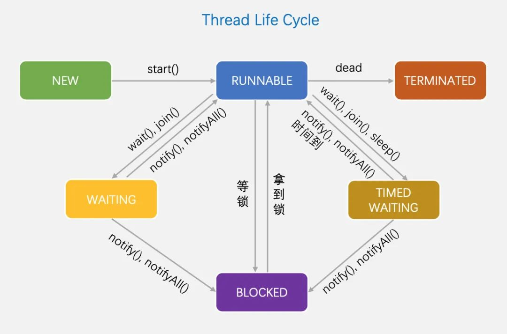

# 概念
1. 并发与并行
并发：一起执行
并行：交替执行
2. 进程与线程
进程：QQ应用
线程：应用中的某个功能
# 线程创建
## 继承Thread类，重写run方法
```java
public class Main {
    public static void main(String[] args) {
        Thread t = new MyThread();
        t.start(); // 启动新线程
    }
}

class MyThread extends Thread {
    @Override
    public void run() {
        System.out.println("start new thread!");
    }
}
```
## 实现Runnable接口，重写run方法
```java
// 多线程
public class Main {
    public static void main(String[] args) {
        Thread t = new Thread(new MyRunnable());
        t.start(); // 启动新线程
    }
}

class MyRunnable implements Runnable {
    @Override
    public void run() {
        System.out.println("start new thread!");
    }
}

```
* 注意：调用 .start 会执行run方法      .start是开线程  直接.run还是只有主线程，会阻塞
*       进程开主线程，mian主线程start另一个线程时，main会与另一个线程一起执行，main不会阻塞
*       主线程结束，不代表进程结束，因为主线程开的另外个线程可能没结束

# 线程方法
## 第一组
setName - 设置线程名称,使之与参数 name 相同
getName - 返回该线程的名称
start - 使该线程开始执行;Java虚拟机底层调用该线程的 start0 方法
run - 调用线程对象 run 方法
setPriority - 更改线程的优先级
getPriority - 获取线程的优先级
sleep - 在指定的毫秒数内让当前正在执行的线程休眠(暂停执行)
interrupt - 中断线程
```java
public class ThreadMethodsDetailedDemo {
    public static void main(String[] args) {
        System.out.println("=== 线程方法详细示例 ===\n");
        
        // 1. setName() 和 getName() 示例
        Thread thread = new Thread(() -> {
            System.out.println("当前线程名称: " + Thread.currentThread().getName());
        });
        
        System.out.println("默认线程名称: " + thread.getName());
        thread.setName("我的自定义线程");
        System.out.println("设置后线程名称: " + thread.getName());
        
        // 2. setPriority() 和 getPriority() 示例
        System.out.println("\n=== 线程优先级示例 ===");
        Thread highPriorityThread = new Thread(new PriorityTask("高优先级线程"));
        Thread lowPriorityThread = new Thread(new PriorityTask("低优先级线程"));
        
        highPriorityThread.setPriority(Thread.MAX_PRIORITY);
        lowPriorityThread.setPriority(Thread.MIN_PRIORITY);
        
        System.out.println("高优先级线程优先级: " + highPriorityThread.getPriority());
        System.out.println("低优先级线程优先级: " + lowPriorityThread.getPriority());
        
        // 3. start() 和 run() 示例
        System.out.println("\n=== start() 和 run() 区别示例 ===");
        
        Thread startThread = new Thread(() -> {
            System.out.println("通过start()启动的线程: " + Thread.currentThread().getName());
        });
        
        Thread runThread = new Thread(() -> {
            System.out.println("通过run()调用的线程: " + Thread.currentThread().getName());
        });
        
        // 使用start()启动线程（推荐）
        startThread.start();
        
        // 直接调用run()方法（不推荐）
        runThread.run();
        
        // 4. sleep() 示例
        System.out.println("\n=== sleep() 示例 ===");
        Thread sleepThread = new Thread(() -> {
            try {
                System.out.println("线程开始休眠3秒...");
                Thread.sleep(3000);
                System.out.println("线程休眠结束！");
            } catch (InterruptedException e) {
                System.out.println("线程在休眠时被中断: " + e.getMessage());
            }
        });
        
        sleepThread.start();
        
        // 5. interrupt() 示例
        System.out.println("\n=== interrupt() 示例 ===");
        Thread interruptThread = new Thread(() -> {
            try {
                for (int i = 0; i < 10; i++) {
                    if (Thread.currentThread().isInterrupted()) {
                        System.out.println("线程被中断，退出循环");
                        return;
                    }
                    System.out.println("执行任务 " + (i + 1));
                    Thread.sleep(1000);
                }
            } catch (InterruptedException e) {
                System.out.println("线程被中断: " + e.getMessage());
            }
        });
        
        interruptThread.start();
        
        // 2秒后中断线程
        try {
            Thread.sleep(2000);
            interruptThread.interrupt();
        } catch (InterruptedException e) {
            e.printStackTrace();
        }
        
        // 等待所有线程结束
        try {
            startThread.join();
            sleepThread.join();
            interruptThread.join();
        } catch (InterruptedException e) {
            e.printStackTrace();
        }
        
        System.out.println("\n所有示例执行完毕！");
    }
}

// 优先级任务类
class PriorityTask implements Runnable {
    private String name;
    
    public PriorityTask(String name) {
        this.name = name;
    }
    
    @Override
    public void run() {
        for (int i = 0; i < 5; i++) {
            System.out.println(name + " 执行任务 " + (i + 1) + 
                             " (优先级: " + Thread.currentThread().getPriority() + ")");
            try {
                Thread.sleep(100);
            } catch (InterruptedException e) {
                System.out.println(name + " 被中断");
                return;
            }
        }
    }
}
```
## 第二组
1. yield: 线程的礼让。让出CPU，表示可以先不管自己让其他线程执行，但礼让的时间不确定，所以也不一定礼让成功。
2. join: 线程的插队。插队的线程一旦插队成功，则肯定先执行完插入的线程所有的任务。
```java
public class ThreadYieldJoinDemo {
    public static void main(String[] args) {
        System.out.println("=== 线程yield()和join()方法案例 ===\n");
        
        // 创建子线程
        Thread childThread = new Thread(new ChildTask(), "子线程");
        
        // 启动子线程
        childThread.start();
        
        // 主线程执行任务
        try {
            for (int i = 1; i <= 20; i++) {
                System.out.println("主线程输出: hi " + i);
                
                // 当主线程输出5次后，让子线程运行完毕
                if (i == 5) {
                    System.out.println("\n--- 主线程输出5次后，让子线程插队执行完毕 ---");
                    childThread.join(); // 子线程插队，主线程等待子线程执行完毕
                    System.out.println("--- 子线程执行完毕，主线程继续执行 ---\n");
                }
                
                // 主线程休眠1秒
                Thread.sleep(1000);
            }
        } catch (InterruptedException e) {
            System.out.println("主线程被中断: " + e.getMessage());
        }
        
        System.out.println("主线程执行完毕！");
    }
}

// 子线程任务类
class ChildTask implements Runnable {
    @Override
    public void run() {
        try {
            for (int i = 1; i <= 20; i++) {
                System.out.println("子线程输出: hello " + i);
                
                // 子线程休眠1秒
                Thread.sleep(1000);
            }
            System.out.println("子线程执行完毕！");
        } catch (InterruptedException e) {
            System.out.println("子线程被中断: " + e.getMessage());
        }
    }
}
```
# 守护线程
## 用户线程
也叫工作线程
生命周期：当线程的任务执行完毕或者通过某种通知方式（如中断、设置标志位等）结束时，用户线程才会终止
## 守护线程
一般是为工作线程（即用户线程）提供服务的后台线程
生命周期：当所有的用户线程都结束时，守护线程会自动终止，无论它是否完成了自己的任务。
常见的守护线程：圾回收机制 (Garbage Collection)
设置守护线程：类名.setDaemon（true）
# 线程生命周期



# 线程同步
<mark>Todo # 线程同步</mark>

在某一时刻只能一个线程来执行
