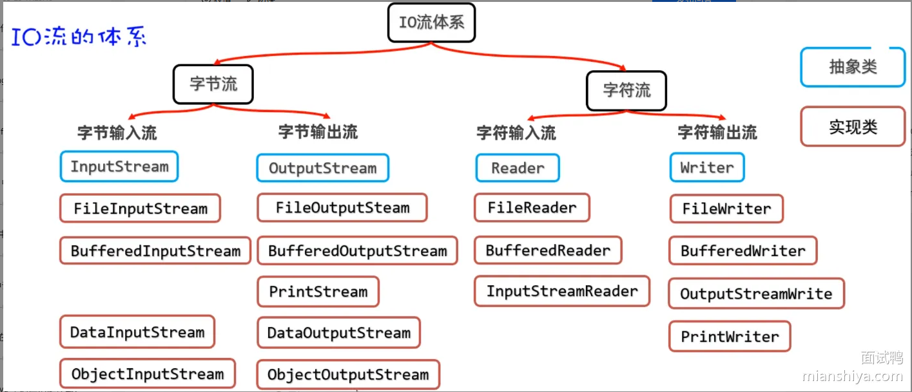

1. @TableField的用法
```java
 /*
 value=""  对应表中列名
 exist = false  表明该字段不在表中
 fill = FieldFill.INSERT  自动填充，需要实现 MetaObjectHandler
 */
@TableField(value="user_id"，exist = false)
 private Long id;
```
2. @EnableEncryptableProperties
加密相关，默认自动开启
3. @ConfigurationPropertiesScan
配置文件注入的类不用写@Component
4. Swagger
5. Collections.emptyList(), CollectionUtils.containsAny，Collectors.groupingBy
返回不可变的空 List；判断两者是否有交集（可用stream代替）；
6. 全局异常拦截器  常见异常的输出日志信息方法 @Valid的MethodArgumentNotValidException异常
7. 什么时候加事务@Transactional
8. NPE预防x ：是包装类型 → 永远不要直接 !x、x && y；比较字符串 → 永远写 "xxx".equals(x)；判断空字符串 → 永远用 isEmpty / isBlank；判断集合空 → 永远用 CollectionUtils.isEmpty(list)；外部接口返回的对象字段 → 默认全部可能为 null
9.  线程池ThreadPoolTaskExecutor和@Async
10. 将前端传来的对象build另外一个对象，脱敏取关键值
11. Spring Security的passwordEncoder 
12. Caffeine  二级缓存 + Redis
13. LDAP 认证基础
14. 本地锁 vs 分布式锁
15. TransactionTemplate 
16. 分组校验 validator.validate()
17. Apache Commons Range 做区间判断

18. 
19. # lombok
# JPA
# 日期API
# Async 注解原理
# bean的循环依赖

# hutool工具类常用方法
# Digest spring自带加密方法类

# 数据安全
# AspectJ
# JWT问题实践
# SSO单点登录实践
# SSO跨域图解
# JDBC-Mybatis(TypeHandlers（类型处理器）,objectFactory,plugins)
# Optional实践
# Mybatis实战

# SpringSecurity,maven 2h，MybatisPus 1h+整理

# Mysql 21h
# linux 27h
# 设计模式 33h
# Redis 42h
# redux 
# MQ,Kafka 12h
# Nginx 4h
# 微服务 44h
# Docker K8s  8h
# CI/CD
# 并发编程 32h
# JVM  68h
# 高可用高并发
# 分布式

# Easy Excel

# Java基础
## 1.Java 中的序列化和反序列化是什么？
1. 序列化（what）：将Java对象转成二进制字节流
2. where：程序执行时（类加载之后）
3. why：解决Java 对象只能存在 JVM 的内存里问题，使JVM关闭后仍可以在磁盘找到保存的对象，下次JVM可以从磁盘获取之前的对象 或者 网络传输 ，将数据从一个JVM 传到 另一个JVM
4. 使用场景：对象持久化，网络远程调用，缓存
5. how:实现Serializable接口，敏感字加transient关键字，显示定义serialVersionUID版本戳
```java
public class User implements Serializable {
    private static final long serialVersionUID = 1L;
    
    private String username;
    private transient String password; // 不参与序列化
    private int age;
}
```
6. 静态变量本身就不参与序列化。因为静态变量属于类级别，所有对象公用的变量，而序列化是将对象实例序列化
7. JDK原生序列化存在问题（性能差，不安全），一般用JSON，Protobuf，Hessian

## 2.Java 中 Exception 和 Error 有什么区别？
1. 常见异常和错误https://pic.code-nav.cn/mianshiya/question_picture/1814905001808924674/j0JcqCQh_image_mianshiya.webp   
2. 编译异常（checked Exception）可能出现的异常，比如数据库连接没设定
3. 运行异常（unchecked Exception）编写错误导致的异常，比如bug,空指针异常
4. 不会去捕获Error，因为JVM出现问题不可靠了，框架开发为了主线程不挂掉可能捕获Error
5. 不要在finally里面进行return，因为只能有一个return，会代替原来的return

## 3. 什么是 Java 的多态特性？
1. 编译看左边，运行看右边
2. 编译时多态（静态多态），方法重载
3. 运行时多态（动态多态），方法重写
4. 静态方法不能被重写
5. 变量的静态绑定，父类的访问不到子类的成员变量
```java
class Animal {
    public String name = "Animal";
}
class Dog extends Animal {
    public String name = "Dog";
}
public class Test {
    public static void main(String[] args) {
        Animal a = new Dog();
        System.out.println(a.name);  //输出Animal

    }
}
```

## 4.Java的优势
跨平台，生态丰富，gc，面向对象

## 5.Java 中的参数传递是按值还是按引用？
都是按值传递，传的都是副本

## 6. 为什么Java不支持多重继承
1. 避免菱形继承，就是如果子类继承的两个父类都有对他们共同父类方法的重写，子类不知道用哪个重写的方法
2. 对于接口多继承，有defualt默认的方法体的话，出现菱形继承，子类必须重写或者指定 父类.super.方法
3. 接口的defualt方法和抽象类的方法有什么区别 
   - defualt方法只有常量，抽象类能有变量
   - defualt多继承，抽象类单继承
   - defualt默认public修饰符，抽象类都能用    

## 7.Java 面向对象编程与面向过程编程的区别是什么？
1. POP 关注过程，OOP 关注对象；
2. POP 数据与函数分离，OOP 数据与行为封装在对象中；
3. OOP 有封装继承多态，更适合大型系统；POP 适合简单高性能任务。

## 8.Java 方法重载和方法重写之间的区别是什么？
1. 重载 返回类型可以不同 形参必须不同 可以重载静态方法 修饰符不受限制
2. 重写 返回类型必须相同或者返回父类的子类 形参必须相同 不能重写静态方法（静态属于类级） 修饰符不能比父类更严格

## 9.什么是 Java 内部类？它有什么作用？
1. 成员内部类
```java
public class OuterClass {
    private String outerField = "Outer Field";

    class InnerClass {
        void display() {
            //可以访问外部类所有成员
            System.out.println("Outer Field: " + outerField);
        }
    }
   
    public void createInner() {
        InnerClass inner = new InnerClass();
        inner.display();
    }
}
 //需要通过外部实例创建
OuterClass outer = new Outer();
OuterClass.InnerClass inner = outer.new InnerClass();
``
```
2. 静态内部类
```java
public class OuterClass {
    private static String staticOuterField = "Static Outer Field";
    //只能访问外部类的静态成员
    static class StaticInnerClass {
        void display() {
            System.out.println("Static Outer Field: " + staticOuterField);
        }
    }

    public static void createStaticInner() {
        StaticInnerClass staticInner = new StaticInnerClass();
        staticInner.display();
    }
}
//不需要通过外部实例创建，直接new
OutClass.StaticInnerClass inner = new OuterClass.StaticInnerClass()
```
3. 局部内部类
```java
class Outer {
    void test() {
        //定义在方法内的内部类
        class Inner {
            void show() {
                //能访问方法中的 final 或 effectively final 局部变量 或 外部类所有成员
                System.out.println("local inner");
            }
        }
        new Inner().show();
    }
}
```
4. 匿名内部类
```java
public class OuterClass {
    interface Greeting {
        void greet();
    }

    public void sayHello() {
        //没有类名，通常实现接口或继承抽象类
        Greeting greeting = new Greeting() {
            //能访问方法中的 final 或 effectively final 局部变量 或 外部类所有成员
            @Override
            public void greet() {
                System.out.println("Hello, World!");
            }
        };
        greeting.greet();
    }
}

```
```java
//Lambda表达式写匿名内部类
// 匿名内部类写法
Runnable r1 = new Runnable() {
    @Override
    public void run() {
        System.out.println("Hello");
    }
};

// Lambda 写法
Runnable r2 = () -> System.out.println("Hello");
```

## 10.Java8 有哪些新特性？
 java8.md
引入元空间代替永久代

## 11.Java11 有哪些新特性？
1. 标准化Http客户端API
2. String方法增强
```java
//1.isBlank和isEmpty区别
//isEmpty() —— 判断字符串长度是否为 0
"".isEmpty();        // true
"  ".isEmpty();      // false（因为长度是 2）
//isBlank() —— 判断是否只包含空白
"".isBlank();        // true
"  ".isBlank();      // true（只有空格，也算 blank）
"\t\n".isBlank();    // true（tab、换行 都算 blank）

//2.strip()和trim()区别
//strip()去掉所有 Unicode 空白 而 trim()只去 ASCII 空白

//3.lines() 分割参照：字符串中的“行终止符”：\n、\r、\r\n
// 将字符串按行分割成 Stream
multiLine.lines()
    .map(line -> "处理: " + line)
    .forEach(System.out::println);

long lineCount = multiLine.lines().count();
System.out.println("总行数: " + lineCount);

//repeat()
System.out.println("Java ".repeat(3)); // "Java Java Java "
System.out.println("=".repeat(50));    // 50个等号
System.out.println("*".repeat(0));     // 空字符串
```
3. File文件读写简化
```java
// 写入文件
String content = "这是一个测试文件\n包含多行内容\n中文支持测试";
//参数：路径，内容，编码 返回值：路径
Path tempFile = Files.writeString(
    Paths.get("temp.txt"), 
    content,
    StandardCharsets.UTF_8
);

// 读取文件
//参数：路径，编码  返回值：内容
String readContent = Files.readString(tempFile, StandardCharsets.UTF_8);
System.out.println("读取的内容:\n" + readContent);
```
```java
//读取大文件：流式处理
try (Stream<String> lines = Files.lines(tempFile)) {
    lines.filter(line -> !line.isBlank())
         .map(String::trim)
         .forEach(System.out::println);
}

```
4. Optional新增isEmpty
## 12.Java17 有哪些新特性？
1. Sealed密封类:控制类的继承
```java
//父类
public sealed class Shape 
    // 只允许这三个类继承
    permits Circle, Rectangle, Triangle {
}
//子类继承后要选择一种继承策略
//final:该子类不能再被继承了
public final class Circle extends Shape {
}

//sealed：和父类一样选择谁能继承我
public sealed class Triangle extends Shape 
    permits RightTriangle {
}

//non-sealed：谁都能继承我
public non-sealed class Rectangle extends Shape {
}
```
2. 增强的伪随机数生成器
3. 强封装JDK内部API:彻底禁止通过反射访问JDK内部类
## 13.Java21 有哪些新特性？
1. Virtual Threads虚拟线程
只要发生线程等待，该线程就可以去执行其他的任务，适用于高并发，IO密集型任务
2. Switch模式匹配
```java
//原来代码
public String processMessage(Object message) {
    if (message instanceof String) {
        String textMessage = (String) message;
        return "文本消息：" + textMessage;
    } else if (message instanceof Integer) {
        Integer numberMessage = (Integer) message;
        return "数字消息：" + numberMessage;
    } else if (message instanceof List) {
        List<?> listMessage = (List<?>) message;
        return "列表消息，包含 " + listMessage.size() + " 个元素";
    } else {
        return "未知消息类型";
    }
}
//Switch模式匹配：匹配类型，若是赋值给形参执行逻辑
public String processMessage(Object message) {
    return switch (message) {
        case String text -> "文本消息：" + text;
        case Integer number -> "数字消息：" + number;
        case List<?> list -> "列表消息，包含 " + list.size() + " 个元素";
        case null -> "空消息";
        default -> "未知消息类型";
    };
}
// 增加判断条件：根据字符串长度采用不同处理策略
public String processText(String text) {
    return switch (text) {
        case String s when s.length() < 10 -> "短文本：" + s;
        case String s when s.length() < 100 -> "中等文本：" + s.substring(0, 5);
        case String s -> "长文本：" + s.substring(0, 10);
    };
}

```
3. Record模式
```java
//定义record
public record Person(String name, int age) {}
public record Address(String city, String street) {}
public record Employee(Person person, Address address, double salary) {}
//类型判断同时进行赋值解构
public String analyzeEmployee(Employee emp) {
    return switch (emp) {
        // 一次性提取所有需要的信息
        case Employee(Person(var name, var age), Address(var city, var street), var salary) 
            when salary > 50000 -> 
            String.format("%s（%d岁）是高薪员工，住在%s%s，月薪%.0f", 
                         name, age, city, street, salary);
        case Employee(Person(var name, var age), var address, var salary) -> 
            String.format("%s（%d岁）月薪%.0f，住在%s", 
                         name, age, salary, address.city());
    };
}
```
4. 有序集合
```java
//补充几个集合方法
List<String> tasks = new ArrayList<>();
tasks.addFirst("鱼皮的任务");    // 添加到开头
tasks.addLast("小阿巴的任务");   // 添加到结尾

String firstStr = tasks.getFirst();  // 获取第一个
String lastStr = tasks.getLast();   // 获取最后一个

String removedFirst = tasks.removeFirst();  // 删除并返回第一个
String removedLast = tasks.removeLast();    // 删除并返回最后一个

List<String> reversed = tasks.reversed();   // 反转列表
```
5. 分代ZGC
分年轻代和老年代（短命区和长寿区）

## 14.Java 中 String、StringBuffer 和 StringBuilder 的区别是什么？
1. 字符串基本不变，只有少量拼接，用String
2. 多线程环境频繁修改字符串，用StringBuffer    线程安全 synchronized加在了整个方法上
3. 单线程下大量拼接操作，用StringBuilder      
```java
//java编译器会将简单的字符串拼接优化成StringBuilder  但是在循环中则会反复创建新的StringBuilder  
String s = "";
for (int i = 0; i < 1000; i++) {
    s += i;   // 为什么不推荐？
}
//正确做法
StringBuilder sb = new StringBuilder();
for (int i = 0; i < 1000; i++) {
    sb.append(i);
}
String s = sb.toString();
```
4. 其他：JDK9之后这三个底层的char数字全换成了byte数组，同时加了个coder字段标记编码方式

### 为什么String不可变
1. 字符串常量池能生效，JVM专门开了一篇区域存字符串常量，一旦可变，别的引用指向的内容一同会变
2. 哈希值可以缓存
3. 天然线程安全

## 15.Java 的 StringBuilder 是怎么实现的？
```java
abstract class AbstractStringBuilder {
    char[] value;  // 可扩容字符数组
    int count;     // 实际存了多少个字符
}
```
### 添加方法append流程
1. 计算要添加的长度
2. 判断容量够不够
3. 不够进行扩容  乘2加2 降低频繁触发扩容数组拷贝
4. 够将内容拷贝到数组中
5. 更新count

### 扩容机制
1. 乘2是为了均摊复杂度，N次apend的总扩容次数是O(logn),总复制量是O(n)
2. 加2是为了处理边界值
3. 初始容量为16

## 16.Java 中包装类型和基本类型的区别是什么？
1. Java八种基础类型：int,long,char,byte,double,float,boolen,short
2. 八种对应的包装类，都是对象
3. 包装类比较值用equals，比较地址用==
### 为什么要用包装类
1. 泛型不支持基础类型
2. 很多API只支持对象
3. 需要表示没有值的状态null
### 自动装箱拆箱
```java
Integer a = 10;        // 编译器变成 Integer.valueOf(10)  自动装箱
int b = a;             // 编译器变成 a.intValue()

//包装类为null，自动拆箱会报空指针异常
Integer a = null;
Integer b = 10;
// 下面这行会 NPE，因为编译器会把 a 拆箱成 int
Integer c = true ? a : 0;
```
### 缓存机制
为减少频繁创建小对象,在一个固定范围内的值，不会每次 new 新对象，而是复用同一个实例。
```java
//发生在自动装箱的时候
//有缓存
Integer a = 127;
Integer b = 127;
System.out.println(a == b);   // true

//缓存超出范围
Integer a = 128;
Integer b = 128;
System.out.println(a == b);   // false

//new必定不缓存
Integer a = new Integer(100);
Integer b = new Integer(100);
System.out.println(a == b);   // false
```
1. Interger缓存范围 -128 —— 127 JVM启动时可修改上限为1000
2. Byte,Short，Long 缓存范围 -128 —— 127   不可调
3. Character 缓存范围 0—— 127
4. Boolen:TRUE和FALSE
5. Float,Double没有缓存

## 17.接口和抽象类有什么区别？
### 抽象类
1. 抽象方法：父类有些方法没什么要写的（子类会重写，父类要有，因为可以多态转型），把这个方法加上abstract  ，这个类也要加上abstract，抽象方法没有方法体
2. 抽象类不能实例化
3. 抽象类至少有一个抽象方法
4. 不能和private,final,static连用，不然继承的子类没法重写
5. 继承抽象类的子类要么自己也是抽象类（不用重写抽象类中的所有抽象方法），或者自己必须重写抽象类中的所有抽象方法
6. 抽象类有构造器，由子类调用
### 接口
1. 接口不能实例化，不带修饰符的方法默认就是 public abstract
2. 抽象类实现（重写）接口时可以不实现接口的方法（不用管接口定义的方法）
3. 一个类可以实现多个接口
4. 接口中的属性都是public static final
5. 接口不能继承类，但能继承多个别的接口
6. 创建接口的修饰符只能punlic和默认
7. 类实现接口，同样也实现了接口的父类（接口多态传递）

## 18.JDK 和 JRE 有什么区别？
1. JDK=JRE(JVM+核心类库)+开发工具集（如Java编译工具）
2. JRE：Java运行环境，如果要运行开发好的.class文件，只要JRE
3. JVM；java虚拟机，不同操作系统有不同的jvm

## 19.你使用过哪些 JDK 提供的工具？
1. jps找 JVM 进程
2. jstack查死锁、线程卡住、CPU 100%
3. jmap/jcmd导出 heap dump、分析内存泄漏
4. jstat监控 GC、堆情况
5. jvisualvm图形化性能分析
6. keytool管理 HTTPS 证书

## 20.Java 中 hashCode 和 equals 方法是什么？它们与 == 操作符有什么区别？
### ==
1. ==是一个比较运算符，既可以判断基本类型，又可以判断引用类型
2. 如果判断基本类型，判断的是值是否相等
3. 如果判断引用类型，判断的是地址是否相等，即判断是不是同一个对象
### equals
1. equal只能判断引用类型，即默认判断地址是否相同，但是源码里String和Integer的equals重写成判断值是否相等
### hashcode
1. 用于定位数组槽位
2. equals返回为true,hashCode一定相同
3. hashCode不同，equals必不同
4. hashCode相同，equals不一定返回true，还要看equals的内容在链表的哪个位置
### 字符串常量池
```java
String a = "hello";
String b = "hello";
System.out.println(a == b); // true，都指向常量池同一个对象（JVM优化）

String c = new String("hello");
System.out.println(a == c); // false，c 在堆里新建了对象
System.out.println(a.equals(c)); // true，内容相同
```
## 21.Java 中的 hashCode 和 equals 方法之间有什么关系？
重写equals必须重写hashCode

## 22.什么是 Java 中的动态代理？
1. JDK 动态代理基于接口实现，通过 Proxy + InvocationHandler 实现（走反射）
2. CGLIB 动态代理直接操作字节码生成目标类子类
3. Spring Boot2 开始默认全部用CGLIB
4. 在运行时生成代理类

## 23.Java 中的注解原理是什么？
本质是个标记，是特殊的接口
```java
//三个阶段
@Retention(RetentionPolicy.SOURCE)  // 只在源码中，编译期处理，用注解处理器APT  Lombok
@Retention(RetentionPolicy.CLASS)   // 进 .class 文件但不可反射访问
@Retention(RetentionPolicy.RUNTIME) // 运行期用反射访问 ✅ Spring 常用
```
## 24.你使用过 Java 的反射机制吗？如何应用反射？
运行期发生，每个类都有一个Class对象，可以通过这个对象获取该类的实例对象，属性方法。
### 获取Class对象
1. Class.forName("全类名")
```java
//多适用于配置文件，读取全路径
String classsAllPath = "com.edu.Car";
Class<?> cls1 = Class.forName(classAllPath);
```
2. 类名.class
```java
//多用于参数传递，比如通过反射得到对应构造器对象
Class cls2 = Car.class;
```
3. 对象.getClass()
```java
//已知某个类的对象实例，通过创建好的类，获取Class对象
Car car = new Car();
Class cls3 = car.getClass();
```
4. 通过类加载器【四种】来获取类的Class对象
```java
//获取类加载器car
ClassLoader classLoader = car.getClass().getClassLoader();
//类加载器得到Class对象
Class cls4 = clasLoader.loadClass(classAllPath);
```
5. 基本数据获取Class对象
```java
//、基本数据(int, char, boolean, float, double, byte, long, short)按如下方式得到Class类对象
Class<Integer> integerClass = int.class;
Class<Character> characterClass = char.class;
Class<Boolean> booleanClass = boolean.class;
System.out.println(integerClass);//int

//6.基本数据类型对应的包装类,可以通过.TYPE 得到Class类对象
Class<Integer> type1 = Integer.TYPE;
Class<Character> type2 = Character.TYPE;
System.out.println(type1);
```
### 有Class对象的类
1. 外部类,成员内部类,静态内部类,局部内部类,匿名内部类
2. interface: 接口
3. 数组
4. enum: 枚举
5. annotation: 注解
6. 基本数据类型
7. void

### Class对象方法
getName: 获取全类名
getSimpleName: 获取简单类名
getFields: 获取所有public修饰的属性,包含本类以及父类的
getDeclaredFields: 获取本类中所有属性
getMethods: 获取所有public修饰的方法,包含本类以及父类的
getDeclaredMethods: 获取本类中所有方法
getConstructors: 获取所有public修饰的构造器,包含本类
getDeclaredConstructors: 获取本类中所有构造器
getPackage: 以Package形式返回包信息
getSuperClass: 以Class形式返回父类信息
getInterfaces: 以Class[]形式返回接口信息
getAnnotations: 以Annotation[] 形式返回注解信息
### Field方法
getModifiers: 以int形式返回修饰符
[说明: 默认修饰符是0, public 是1, private 是2, protected 是4, static 是8, final 是16], public(1) + static (8)
getType: 以Class形式返回类型
getName: 返回属性名
```java
     // 获取Student类的Class对象
        Class<Student> clazz = Student.class;
        
        // 获取所有字段
        Field[] fields = clazz.getDeclaredFields();
        
        System.out.println("=== Field类方法示例 ===\n");
        
        for (Field field : fields) {
            System.out.println("字段名: " + field.getName());
            System.out.println("字段类型: " + field.getType());
            System.out.println("修饰符值: " + field.getModifiers());
            System.out.println("修饰符解析: " + getModifierString(field.getModifiers()));
            System.out.println("---");
        }
  ```
### setAccessible
作用：启动和禁用访问安全检查的开关
参数为true：取消访问检查，提高反射效率
参数为false：执行访问检查，保持安全性
```java
import java.lang.reflect.Field;

public class PrivateFieldDemo {
    public static void main(String[] args) throws Exception {
        User user = new User(1, "李四");
        
        // 获取私有字段
        Field nameField = User.class.getDeclaredField("name");
        
        // 设置可访问性
        nameField.setAccessible(true);
        
        // 读取私有字段值
        String name = (String) nameField.get(user);
        System.out.println("私有字段name的值: " + name);
        
        // 修改私有字段值
        nameField.set(user, "王五");
        System.out.println("修改后的用户: " + user);
    }
}
```
## 25.什么是 Java 中的不可变类？
对象一旦创建，状态不可改变，如String,Integer,Long等包装类<br/>
1. 类声明为final
2. 所有字段为private final,只在构造阶段赋值一次
3. 通过构造函数初始化所有字段
4. 没有setter
5. 如果字段是可变对象，getter必须返回副本，不可暴露原对象<br/>

优势：线程安全，适合做缓存key
```java
public final class ImmutablePerson {
    private final String name;
    private final List<String> hobbies;
    
    public ImmutablePerson(String name, List<String> hobbies) {
        this.name = name;
        // 防御性拷贝，不直接引用外部传入的可变对象
        this.hobbies = new ArrayList<>(hobbies);
    }
    
    public String getName() {
        return name; // String 本身不可变，直接返回
    }
    
    public List<String> getHobbies() {
        // 返回副本，保护内部状态
        return new ArrayList<>(hobbies);
    }
}
```
## 26. 什么是 Java 的 SPI（Service Provider Interface）机制？
1. 调用方提供统一的接口，让第三方去实现
2. Java SPI 是一种服务发现机制，通过在 META-INF/services/接口全名 中配置实现类，使得 ServiceLoader 在运行时动态加载接口的实现，实现模块间解耦。它广泛应用于 JDBC、日志框架和 Spring Boot 自动装配中。SPI 的原理依赖于配置文件 + 类加载 + 反射。缺点是无法按需加载、性能一般，因此很多框架在 SPI 基础上做了增强。

## 27.Java 泛型的作用是什么？
1. 编译期提前检查类型匹配
2. 消除强转
3. 代码复用
```java
// 没泛型的时代
List list = new ArrayList();
list.add("hello");
String s = (String) list.get(0);  // 必须强转，转错了运行时才知道

// 有泛型之后
List<String> list = new ArrayList<>();
list.add("hello");
String s = list.get(0);  // 不用强转，编译器帮你搞定
list.add(123);  // 编译直接报错，塞不进去

//泛型方法
public static <T> T getFirst(List<T> list) {
    return list.isEmpty() ? null : list.get(0);
}

// 调用时编译器自动推断类型
String first = getFirst(Arrays.asList("a", "b", "c"));
```
## 28.泛型擦除
泛型只存在编译期，运行期会消失<br/>
1. 运行期间new数组不知道类型，数组不能加泛型
2. 泛型无法instance of
3. 通过泛型可以在运行期间获取泛型的成员变量的泛型类型

## 29.什么是 Java 泛型的上下界限定符？
1. 上限定符 ? extend T 只能是T或T的子类
2. 下限定符 ? super T 只能是T或T的父类
```java
// 上界：只读不写
public void process(List<? extends Number> list) {
    Number num = list.get(0);  // 读取安全，返回 Number 或其子类
    // list.add(1);            // 编译错误，不能往里加东西
}

// 下界：只写不读
public void addToList(List<? super Integer> list) {
    list.add(1);               // 写入安全，Integer 肯定能放进去
    // Integer v = list.get(0); // 编译错误，读出来只能当 Object
}
```
PECS<br/>
1. 从集合拿东西来写，集合是生产者，用extends
2. 从集合塞东西，集合是消费者，用super

## 30.Java 中的深拷贝和浅拷贝有什么区别？
1. 浅拷贝拷贝的是引用地址，里面引用类型的值共享一个
2. 深拷贝是完全拷贝出一个新的，两者完全独立
```java
//浅拷贝
class Person implements Cloneable {
    String name;
    int age;
    Address address;  // 引用类型

    @Override
    protected Object clone() throws CloneNotSupportedException {
        return super.clone();  // 浅拷贝，address 还是指向同一个对象
    }
}

//深拷贝
//1.手动递归
@Override
protected Object clone() throws CloneNotSupportedException {
    Person cloned = (Person) super.clone();      // 先浅拷贝整体
    cloned.address = (Address) address.clone();  // 递归克隆内部对象
    return cloned;
}
//2.序列化反序列化
//JSON序列化
```

## 31.什么是 Java 的 BigDecimal？
1. 不可变类
2. 解决浮点数不精确的问题
3. 可用long存储最小单位再做转换
4. 用整数和小数点位置进行存储
```java
//1.创建BigDecimal
// 错误写法，会引入精度问题
BigDecimal bad = new BigDecimal(0.1);
System.out.println(bad);  // 输出 0.1000000000000000055511151231257827021181583404541015625

// 正确写法一：用字符串构造
BigDecimal good1 = new BigDecimal("0.1");
System.out.println(good1);  // 输出 0.1

// 正确写法二：用 valueOf
BigDecimal good2 = BigDecimal.valueOf(0.1);
System.out.println(good2);  // 输出 0.1

//2.除法指定精度和舍入模式
BigDecimal a = new BigDecimal("1");
BigDecimal b = new BigDecimal("3");
// 错误写法，会抛异常
// BigDecimal c = a.divide(b);  // ArithmeticException: Non-terminating decimal expansion

// 正确写法，指定保留 4 位小数，四舍五入
BigDecimal c = a.divide(b, 4, RoundingMode.HALF_UP);
System.out.println(c);  // 输出 0.3333

//3.比较用compareTo而不是equals
BigDecimal a = new BigDecimal("1.0");
BigDecimal b = new BigDecimal("1.00");
System.out.println(a.equals(b));     // false，精度不同
System.out.println(a.compareTo(b));  // 0，值相等
```
## 32.如何在 Java 中调用外部可执行程序或系统命令？
Java 可以通过 Runtime.exec() 或 ProcessBuilder 调用外部命令，其中 ProcessBuilder 是推荐方式。
通过 ProcessBuilder.start() 启动进程，可读取 InputStream 和 ErrorStream 获取输出，并通过 waitFor() 获取执行状态

## 33.如果一个线程在 Java 中被两次调用 start() 方法，会发生什么？
会报illegalThreadStateException.
### 多线程基础
1. 多线程基础.md
2. execute 没有返回值，只能提交 Runnable
3. submit 有返回值 Future，可以提交 Runnable 和 Callable
4. execute 的异常会直接抛出
5. submit 的异常会被封装在 Future 中，调用 get() 才能拿到

## 34. 栈和队列在 Java 中的区别是什么？
1. 队列和栈
```java
// 栈：用 Deque 接口，推荐 ArrayDeque
Deque<Integer> stack = new ArrayDeque<>();
stack.push(1);  // 入栈
stack.push(2);
stack.pop();    // 出栈，返回 2（后进先出）

// 队列：用 Queue 接口
Queue<Integer> queue = new LinkedList<>();
queue.offer(1);  // 入队
queue.offer(2);
queue.poll();    // 出队，返回 1（先进先出）
```
2. 双端队列
```java
//Deque实际上是双端队列
Deque<String> deque = new ArrayDeque<>();

// 当栈用
deque.push("a");
deque.push("b");
deque.pop();  // 返回 "b"

// 当队列用
deque.offerLast("x");
deque.offerLast("y");
deque.pollFirst();  // 返回 "x"
```
3. 阻塞队列
```java
BlockingQueue<String> queue = new ArrayBlockingQueue<>(100);
// 生产者线程
new Thread(() -> {
    while (true) {
        queue.put(produceData());  // 满了自动阻塞
    }
}).start();

// 消费者线程
new Thread(() -> {
    while (true) {
        String data = queue.take();  // 空了自动阻塞
        consume(data);
    }
}).start();
```
## 35.Java 的 Optional 类是什么？它有什么用？
1. 用来包装可能为空的值
2. 作用于方法返回值
```java
//用Optional前
User user = userService.getUser(id);
if (user != null) {
    Address address = user.getAddress();
    if (address != null) {
        String city = address.getCity();
        if (city != null) {
            System.out.println(city);
        }
    }
}
//用Optional后
Optional.ofNullable(userService.getUser(id))
        .map(User::getAddress)
        .map(Address::getCity)
        .ifPresent(System.out::println);
//函数返回值类型为Optional用flatMap,否则用map返回时加上Optional

//ifPresent
Optional<String> opt = Optional.ofNullable(name);

opt.ifPresent(value -> {
    System.out.println(value);
});
//等价于
if (name != null) {
    System.out.println(name);
}
```
### 核心API
#### 创建Optional
1. Optional.of(value)  包装非空值，传null抛出空指针异常  放确定为空的值
2. Optional.ofNullable(value) 包装可能为空的值，传null返回空Optional  放可能为空的值
3. Optional.empty() 创建一个空的Optional  表示没有值
```java
//取值
Optional<String> opt = Optional.ofNullable(getValue());

// 直接取，空了抛 NoSuchElementException（不推荐）
opt.get();

// 空了返回默认值
opt.orElse("default");

// 空了调用 Supplier 生成默认值
// 1.orElse：不管 Optional 有没有值，createDefault() 都会执行
opt.orElse(createDefault());

// 2. orElseGet：只有 Optional 为空时才会执行 Supplier
opt.orElseGet(() -> createDefault());

// 空了抛自定义异常
opt.orElseThrow(() -> new BusinessException("not found"));
```
```java
//java9其他API
// ifPresentOrElse：有值执行第一个，没值执行第二个
opt.ifPresentOrElse(
    value -> System.out.println(value),
    () -> System.out.println("empty")
);

// or：空的时候返回另一个 Optional
opt.or(() -> Optional.of("fallback"));

// stream：转成 Stream，空的就是空流
opt.stream().forEach(System.out::println);
```
## 36.Java 的 I/O 流是什么？
<br/>


## 37.什么是 Java 的网络编程？
<br/>

## 38.Java 中的基本数据类型有哪些？
1. 整数：byte(1)、short(2)、int(4)、long(8)
2. 小数：float(4)、double(8)
3. 字符：char(2)
4. 布尔：boolean()

## 39.什么是 Java 中的迭代器（Iterator）？
1. 用于遍历集合
2. for each是对Iterator的封装，调用list.remove会报错，因为没用Iterator.remove
3. remove安全删除，不会报错ConcurrentModificationException，因为Fail-Fast，在使用 Iterator 遍历集合时，如果集合结构被非 Iterator 自身修改，就会抛出异常。
4. listIterator双向遍历
```java
List<String> list = new ArrayList<>(Arrays.asList("A", "B", "C"));
Iterator<String> it = list.iterator();
//hasNext是否有下一个
while (it.hasNext()) {
    //next取出下一个
    String item = it.next();
    if ("B".equals(item)) {
        // remove安全删除，不会报错
        it.remove();  
    }
}
```
```java
// listIterator双向遍历
List<String> list = new ArrayList<>(Arrays.asList("A", "B", "C"));
ListIterator<String> it = list.listIterator();

// 正向遍历
while (it.hasNext()) {
    System.out.println(it.next());
}

// 反向遍历
while (it.hasPrevious()) {
    System.out.println(it.previous());
}

set(E e) //替换元素
add(E e) //插入元素
nextIndex()/previousIndex() //获取索引
```
## 40.Java 中的访问修饰符有哪些？
| 访问修饰符 | 同一个类 | 同一个包 | 子类（不同包） | 其他包 |
|------------|----------|----------|----------------|--------|
| public     | ✅       | ✅       | ✅             | ✅     |
| protected  | ✅       | ✅       | ✅             | ❌     |
| 默认(default) | ✅    | ✅       | ❌             | ❌     |
| private    | ✅       | ❌       | ❌             | ❌     |

## 41. Java 中 wait() 和 sleep() 的区别？ 
1. wait() 是 Object 的方法，用于线程之间的通信，必须在 synchronized 中调用，并且会释放对象锁
2. sleep() 是 Thread 的静态方法，用于让线程休眠，不需要同步块，也不会释放锁
3. wait() 依赖 notify 唤醒，sleep() 到时间自动恢复

## 42.什么是 BIO、NIO、AIO？
1. BIO 是同步阻塞 I/O，一个连接对应一个线程，并发能力低；
2. NIO 是同步非阻塞 I/O，通过 Selector 实现多路复用，一个线程可处理多个连接；
3. AIO 是异步非阻塞 I/O，I/O 操作由系统异步完成，通过回调通知结果，并发能力最高。

## 43.NIO
### 什么是Selector
多路复用器，一个Selector监听多个Channel的IO事件<br/>
1. 连接完成OP_CONNECT
2. 可读OP_READ
3. 可写OP_WRITE
4. 接收连接OP_ACCEPT
```java
// 1. 创建 Selector
Selector selector = Selector.open();

// 2. Channel 必须设置成非阻塞
channel.configureBlocking(false);

// 3. 注册到 Selector，声明感兴趣的事件
SelectionKey key = channel.register(selector, SelectionKey.OP_READ);

// 4. 事件循环
while (true) {
    int readyNum = selector.select();  // 阻塞等待事件
    if (readyNum == 0) continue;
    
    Set<SelectionKey> selectedKeys = selector.selectedKeys();
    Iterator<SelectionKey> it = selectedKeys.iterator();
    while (it.hasNext()) {
        //SelectionKey保存Selector和Channel之间的关系
        SelectionKey k = it.next();
        if (k.isAcceptable()) {
            // 处理新连接
        } else if (k.isReadable()) {
            // 处理读事件
        } else if (k.isWritable()) {
            // 处理写事件
        }
        it.remove();  // 必须手动移除，否则下次还会处理
    }
}
```
### 什么是Channel
Channel 是 NIO 中的数据通道，负责与外部设备进行数据读写，与Buffer绑定<br/>
Channel类型与用途<br/>
1. FileChannel   文件I/O
2. SocketChannel    TCP 客户端
3. ServerSocketChannel   TCP 服务端
4. DatagramChannel    UDP

## 44.PO、VO、BO、DTO、DAO、POJO 有什么区别？
| 名称 | 全称 | 所在层 | 主要作用 |
|------|------|--------|----------|
| PO | Persistent Object | 持久层 | 与数据库表一一对应 |
| DTO | Data Transfer Object | 接口/传输层 | 数据传输 |
| VO | View Object | 表现层 | 前端展示 |
| BO | Business Object | 业务层 | 业务逻辑处理 |
| POJO | Plain Old Java Object | 通用 | 无特殊职责的普通 Java 对象 |
### 调用顺序
VO-DTO-BO-PO

# JVM基础
## 编译，编译型与解释型语言
1. 编译是将人写的源码编译成程序看得懂的语言
2. java的编译是通过编译器编译成字节码让JVM解释直接执行   <mark> 编译器+jvm解释器（JIT）<mark>
3. C/C++的编译是编译成机器码直接让cpu解释执行   <mark>编辑器<mark>
4. python是通过解释器直接边读边执行   <mark>解释器<mark>
5. 编译型语言相对解释型语言 启动慢但运行快 不能跨平台（机器码依赖于平台本身） 调试起来相对麻烦（要重新编译）

## 组织架构
### 类加载器
1. 将字节码文件加载到内存当中
### 运行时数据区
1. 存放数据
### 执行引擎
1. 解释器，JIT,GC

## 类加载机制
整个生命周期分为七个阶段，分别是加载、验证、准备、解析、初始化、使用和卸载。其中验证、准备和解析这三个阶段统称为连接。除去使用和卸载，就是 Java 的类加载过程。
### Loading（载入）
将字节码从数据源变成二进制字节流存入内存
### Verification（验证）
对二进制字节流进行校验
### Preparation（准备）
为静态变量（static 关键字修饰的）分配空间，赋默认值。静态方法有入口地址而实例方法得new之后才有入口地址
### Resolution（解析）
1. 将常量池中的符号引用转化为直接引用。
2. 符号引用：用符号代表引用关系
3. 直接引用：直接引用实际内存地址
4. 如果有动态加载，解析会推迟到初始化之后。因为符号转为直接引用的内存地址不是静态固定的
### Initialization（初始化）
执行类构造器方法

## 类加载器
1. 引导类加载器（Bootstrap ClassLoader）：负责加载 JVM 基础核心类库，如 rt.jar、sun.boot.class.path 路径下的类。
2. 扩展类加载器（Extension ClassLoader）：负责加载 Java 扩展库中的类，例如 jre/lib/ext 目录下的类或由系统属性 java.ext.dirs 指定位置的类。
3. 系统（应用）类加载器（System ClassLoader）：负责加载系统类路径 java.class.path 上指定的类库，通常是你的应用类和第三方库。
4. 用户自定义类加载器：Java 允许用户创建自己的类加载器，通过继承 java.lang.ClassLoader 类的方式实现。这在需要动态加载资源、实现模块化框架或者特殊的类加载策略时非常有用。
### 双亲委派模型
类加载器永远会先让父类加载器进行加载。  <br/>
1. 安全：不会自己写个String类库让底部类加载器执行，以后就用自己写的String类库。因为永远是Bootstrap ClassLoader去加载核心类库，而且会去特定安全区域找，不会找到自己写的String类库
2. 类不会被重复加载（父类加载过的子不会再加载）
