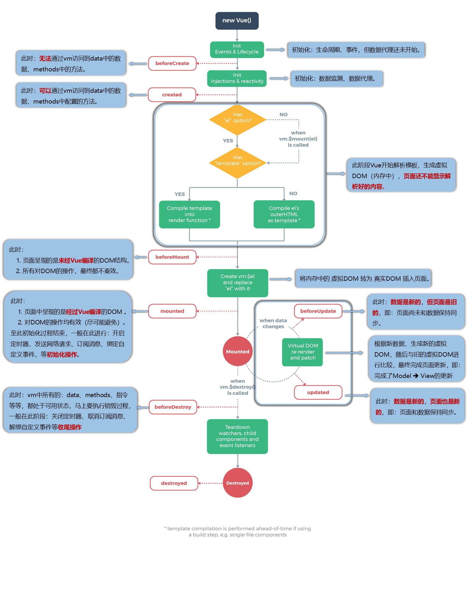

### mounted  	Vue完成模板的解析并把初始的真实DOM元素放入页面后（挂载完毕）调用mounted
``` js
Vue.$el   虚拟dom转向真实dom时备份的真实dom
new Vue({
			el:'#root',
			data:{
				a:false,
				opacity:1
			},
      //有配置模板先用模板生成虚拟dom
			template: `<div>
      里面的内容会把<div id="root"></div>全部替换
      </div>`,
			//Vue第一次解析完模板时调用一次mounted，之后data改变重新解析不会再调mounted
			mounted(){
        //页面渲染之后要立马执行的逻辑
        console.log(this)     //this执行Vue对象实例
			},
      //最终不会显示解释：此时的修改只会影响控制台的显示，因为此时虚拟dom已经生成好了，这函数过去之后就用虚拟dom的数据生成真实dom
      beforeMount() {
				console.log('beforeMount')
			},
		})
  ```
 

### 49-51 笔记完善
		<!-- 
				常用的生命周期钩子：
						1.mounted: 发送ajax请求、启动定时器、绑定自定义事件、订阅消息等【初始化操作】。
						2.beforeDestroy: 清除定时器、解绑自定义事件、取消订阅消息等【收尾工作】、数据更新不会在页面中显示

				关于销毁Vue实例
						1.销毁后借助Vue开发者工具看不到任何信息。
						2.销毁后自定义事件会失效，但原生DOM事件依然有效。
						3.一般不会在beforeDestroy操作数据，因为即便操作数据，也不会再触发更新流程了。
		-->

### 疑惑
```js
new Vue({
			el:'#root',
			data:{},
			mounted(){
				this.timer = setInterval(() => {
			})},
			beforeDestroy() {
				clearInterval(this.timer)
			},
		})
```
> this.timer为什么data里面都没有timer，却可以用this.timer接收定时器?
> JavaScript对象可以动态添加属性，不需要预先声明,但这种方式添加不是响应式的，而定时器也不需要get和set进行响应式。如果在data中添加属性timer，那么timer就是响应式的了