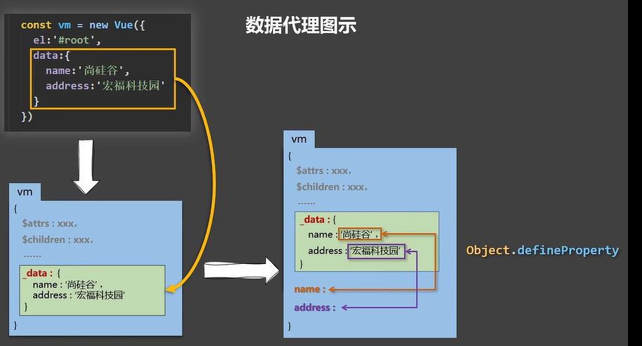

### 数据代理和Object.defineProperty方法
  
  * 总结：代理对象obj2，要有目标对象的数据，通过Object.defineProperty方法进行实现，里面的get和set实现了双向数据的绑定
  * get:目标对象修改，代理对象改；set：代理对象修改，目标对象改
  
  ### Vue的数据代理
  * 代理对象：vue实例  目标对象： _data
  * 说明：1._data是vue实例里面的一个对象属性，里面的内容就是js里面new vue的配置对象参数里面的 属性data对象
          2.然后vue实例做了数据代理，vue实例里面直接有_data的属性（比如data有属性name，vue._data.name对应直接有vue.name）
          3.实现方法就是通过Object.defineProperty把data对象的所有属性添加到vm对象上
          4.这样做，在模板语法中才可以直接{{name}}而不用{{_data.name}}
   