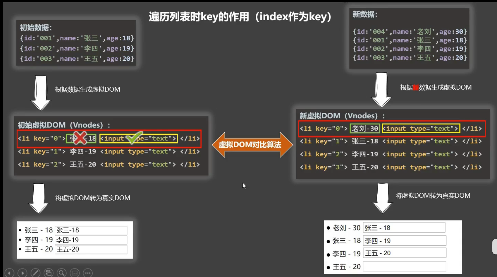

``` html
<!-- 一.条件渲染 -->
<div id="root">
  <!--1.v-show -->
  <!-- ""双引号里面可以写表达式 -->
  <h2 v-show="a">{{name}}</h2>
  <!-- v-show 节点在,适合频繁切换   v-if 增加删除节点 -->

  <!--2.v-if -->
  <div v-if="n === 1">Angular</div>
  <div v-else-if="n === 2">React</div>
  <div v-else-if="n === 3">Vue</div>
  <div v-else></div>
  <!-- v-if与template的配合使用,template不会影响结构 -->
  <template v-if="n === 1">
    <h2>你好</h2>
    <h2>尚硅谷</h2>
    <h2>北京</h2>
  </template>
</div>

<script>
  new Vue({
    el: '#root',
    data: {
      name: '条件渲染',
      a: false
    }
  })
</script>
```
### key的原理
  
  # Vue会先生成虚拟dom再变成真实dom，然后数据发生改变时可以通过对比算法复用数据
  # 由于对比算法是按顺序根据索引值排，而key是索引值的话，逆序插入等操作会改变原来数据对应的索引值
  # 对于一行来说，数据不对重新生成，标签对应进行复用，导致将输入框复用了其他的内容

  ## 用index作为key可能会引发的问题：
			1. 若对数据进行：逆序添加、逆序删除等破坏顺序操作:
				会产生没有必要的真实DOM更新 ==> 界面效果没问题, 但效率低。

      2. 如果结构中还包含输入类的DOM：
				会产生错误DOM更新 ==> 界面有问题。

``` html
<!-- 二.列表渲染 -->
<div id="root2">
  <ul>
    <!-- 1.遍历数组 -->
    <!-- p是一个形参,循环代表数组里面的每一项   要求每个遍历对象的key不一样-->
    <li v-for="p in persons" :key="p.id">{{p.name}}</li>
    <!-- 如果写两个形参,第一个循环代表数组里面的每一项,第二个代表索引值   索引不会重复,可以当key-->
    <li v-for="(p,index) in persons" :key="index">{{p}}--{{index}}</li>

    <!-- 2.遍历对象 -->
    <!-- 第一个形参是值,第二个是属性名   属性名不会重复,可以当key-->
    <li v-for="(value,k) in car" :key="k">{{value}}--{{key}}</li>

    <!-- 3.遍历字符串 -->
    <!-- 第一个形参是字符串的每个字符,第二个是索引   索引可以当key-->
    <li v-for="(a,b) in str" :key="b">{{a}}--{{b}}</li>

    <!-- 4.遍历次数 -->
    <!-- 第一个形参是从1-5的每个数字,第二个是索引   索引可以当key-->
    <li v-for="(number,b) in 5" :key="b">{{a}}--{{b}}</li>
  </ul>
</div>

<script>
  new Vue({
    el: '#root2',
    data: {
      //数组
      persons: [
        { id: '001', name: '张三', age: 18 },
        { id: '002', name: '李四', age: 19 },
        { id: '003', name: '王五', age: 20 }
      ],
      //对象
      car: {
        name: '奥迪A8',
        price: '70万',
        color: '黑色'
      },
      str: 'hello'
    }
  })
</script>
``` 